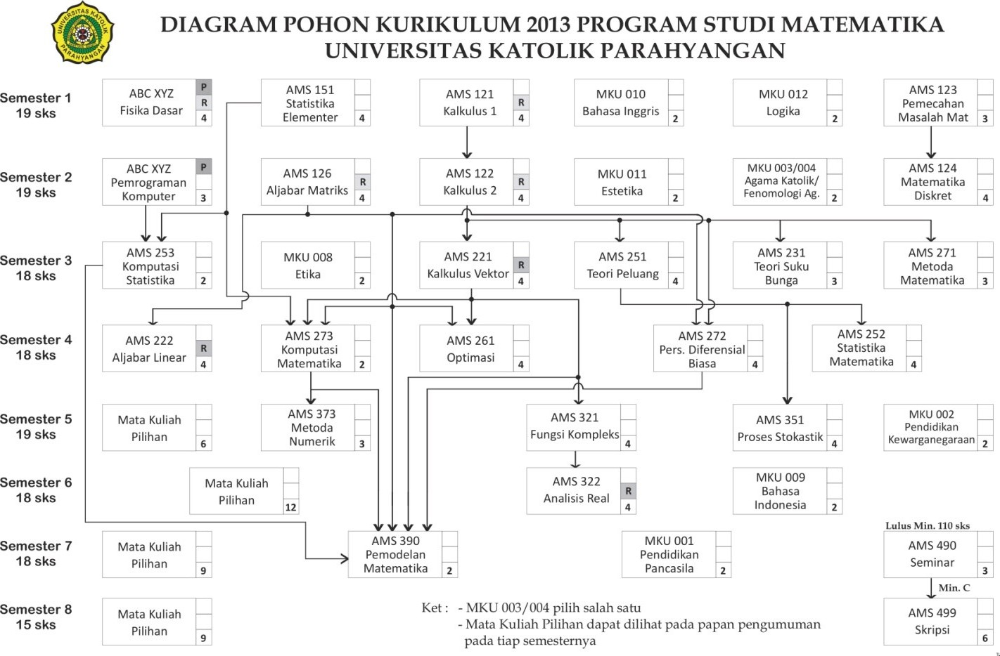
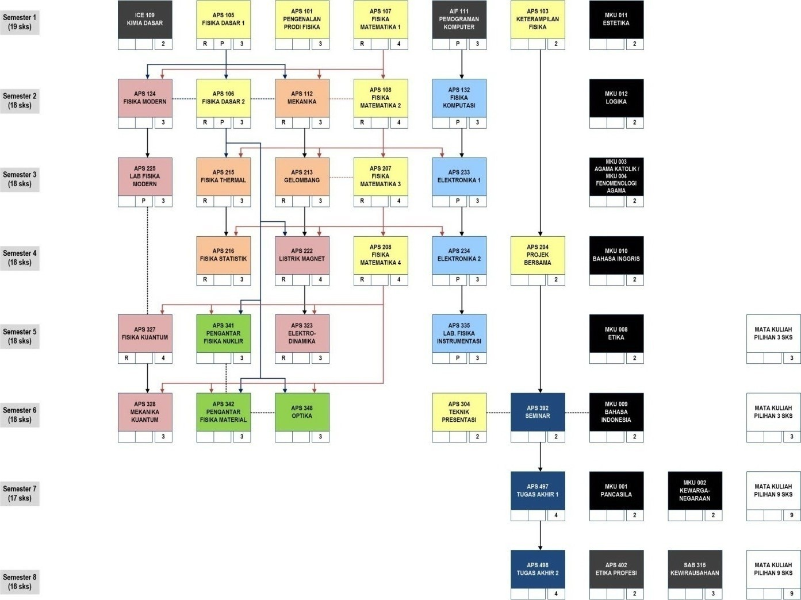

#BAB 2 PENYELENGGARAAN MATA KULIAH

Secara umum matakuliah yang diselenggarakan oleh program studi dapat dikelompokkan kedalam dua jenis yaitu **matakuliah wajib** dan **matakuliah pilihan**. Matakuliah wajib merupakan matakuliah yang sifatnya wajib/harus ditempuh oleh setiap mahasiswa. Sebagian dari matakuliah wajib tersebut termasuk kedalam kelompok **matakuliah umum** (MKU), yaitu matakuliah yang terkait dengan pengembangan kepribadian yang diselenggarakan oleh Lembaga Pengembangan Humaniora. 

Matakuliah pilihan bertujuan untuk menyiapkan mahasiswa untuk memasuki dunia kerja dan memperluas wawasan mahasiswa terhadap bidang ilmu lain sehingga memungkinkan melakukan tugas interdisiplin. Matakuliah pilihan dapat diambil dari matakuliah pilihan yang diselenggarakan oleh program studi (prodi) yang bersangkutan, atau matakuliah (baik wajib maupun pilihan) yang diselenggarakan oleh prodi lain di lingkungan UNPAR. Mahasiswa mengambil matakuliah pilihan berdasarkan persetujuan dari dosen wali.

Selain matakuliah-matakuliah di atas, dikenal juga apa yang disebut dengan **matakuliah prasyarat**. Matakuliah prasyarat adalah matakuliah yang harus ditempuh seorang mahasiswa sebelum ia dapat menempuh suatu matakuliah tertentu. 

Di samping matakuliah-matakuliah yang ditujukan untuk program studinya sendiri, prodi-prodi juga menyelenggarakan matakuliah yang ditujukan untuk program studi lain. Matakuliah ini disebut dengan **matakuliah layanan**.

Selain tatap muka di kelas, suatu matakuliah dapat mengandung kegiatan lain untuk mendukung perkuliahan, yaitu asistensi, responsi, atau praktikum yang biasa disingkat dengan **APR**. 

##2.1 Matakuliah Pilihan
Mahasiswa harus menempuh sejumlah SKS tertentu matakuliah pilihan, dengan sejumlah SKS di antaranya mata kuliah yang diselenggarakan prodinya. Jumlah SKS matakuliah ini berbeda-beda untuk setiap prodi: 

1.	Untuk Matematika, 48 SKS dengan minimal lulus 15 SKS berasal dari salah satu bidang kajian (Rekayasa Keuangan atau Matematika Industri).
2.	Untuk Fisika, 24 SKS yang dapat diambil dari seluruh prodi di UNPAR.
3.	Untuk Teknik Informatika, 30 SKS dengan banyaknya matakuliah pilihan dari luar jurusan yang dapat diperhitungkan dalam kelulusan adalah sebanyak-banyaknya 4 (empat) matakuliah.

Untuk matakuliah pilihan, terdapat beberapa ketentuan sebagai berikut:

1.	Bila matakuliah tersebut memiliki prasyarat, mahasiswa dari prodi lain tidak perlu memenuhi prasyarat tersebut.
2.	Matakuliah pilihan dan matakuliah di prodi lain yang ekivalen dengannya, hanya dapat diperhitungkan salah satunya.

##2.2 Matakuliah Prasyarat
Matakuliah prasyarat adalah matakuliah yang harus ditempuh seorang mahasiswa sebelum ia dapat menempuh suatu matakuliah tertentu. Berkaitan dengan hal ini, terdapat tiga kategori:

1.	**Prasyarat tempuh**, artinya matakuliah tersebut telah terdaftar dalam rencana studi mahasiswa yang bersangkutan dan bernilai akhir A, B, C, D, atau E, walaupun tentunya kelulusan akan sangat menunjang penempuhan matakuliah berikutnya.
2.	**Prasyarat lulus**, artinya mahasiswa harus lulus matakuliah prasyarat tersebut terlebih dahulu. Pada umumnya syarat kelulusan adalah nilai akhir minimum D, meskipun ada juga yang lebih tinggi. Silahkan melihat silabus matakuliah ybs. untuk keterangan lebih lanjut.
3.	Mahasiswa di luar prodi penyelenggara matakuliah tidak wajib memenuhi prasyarat ini.

##2.3 Matakuliah Layanan
Matakuliah layanan adalah matakuliah yang dibina oleh prodi yang ada di FTIS untuk memenuhi kebutuhan matakuliah pada prodi lain di lingkungan UNPAR. 

###2.3.1 Kuliah Layanan Program Studi Matematika

*	Kode : AMS100  
	Mata Kuliah : Matematika Informatika  
	SKS : 4  
	Prodi yang dilayani : Teknik Informatika  

*	Kode : AMS200  
	Mata Kuliah : Probabilitas dan Statistika  
	SKS : 3  
	Prodi yang dilayani : Teknik Informatika   

*	Kode : AMS107  
	Mata Kuliah : Fisika Matematika I  
	SKS : 4  
	Prodi yang dilayani : Fisika  
	
*	Kode : AMS108  
	Mata Kuliah : Fisika Matematika II  
	SKS : 4  
	Prodi yang dilayani : Fisika  

*	Kode : AMS103  
	Mata Kuliah : Kalkulus I  
	SKS : 2  
	Prodi yang dilayani : Teknik Industri  

*	Kode : AMS104  
	Mata Kuliah : Kalkulus II  
	SKS : 2  
	Prodi yang dilayani : Teknik Industri  

*	Kode : AMS203  
	Mata Kuliah : Matriks dan Ruang Vektor  
	SKS : 3  
	Prodi yang dilayani : Teknik Industri  

*	Kode : AMS204  
	Mata Kuliah : Kalkulus Peubah Banyak  
	SKS : 2  
	Prodi yang dilayani : Teknik Industri  

*	Kode : AMS105  
	Mata Kuliah : Kalkulus I  
	SKS : 3  
	Prodi yang dilayani : Teknik Kimia  

*	Kode : AMS106  
	Mata Kuliah : Kalkulus II  
	SKS : 3  
	Prodi yang dilayani : Teknik Kimia  

*	Kode : AMS101  
	Mata Kuliah : Matematika 1  
	SKS : 3  
	Prodi yang dilayani : Teknik Sipil  

*	Kode : AMS102  
	Mata Kuliah : Matematika 2  
	SKS : 3  
	Prodi yang dilayani : Teknik Sipil  

*	Kode : AMS201  
	Mata Kuliah : Matematika 3  
	SKS : 3  
	Prodi yang dilayani : Teknik Sipil  

*	Kode : AMS202  
	Mata Kuliah : Matematika 4  
	SKS : 3  
	Prodi yang dilayani : Teknik Sipil
	
###2.3.2 Kuliah Layanan Program Studi Fisika

*	Kode : APS181  
	Mata Kuliah : Fisika Dasar  
	SKS : 4  
	Prodi yang dilayani : Matematika  

*	Kode : APS182  
	Mata Kuliah : Fisika Dasar  
	SKS : 3  
	Prodi yang dilayani : Teknik Sipil  

*	Kode : APS183  
	Mata Kuliah : Fisika Dasar I  
	SKS : 2  
	Prodi yang dilayani : Teknik Industri  

*	Kode : APS184  
	Mata Kuliah : Fisika Dasar II  
	SKS : 2  
	Prodi yang dilayani : Teknik Industri  

*	Kode : APS185  
	Mata Kuliah : Fisika Dasar I  
	SKS : 2  
	Prodi yang dilayani : Teknik Kimia  

*	Kode : APS186  
	Mata Kuliah : Fisika Dasar II  
	SKS : 2  
	Prodi yang dilayani : Teknik Kimia  

*	Kode : APS187  
	Mata Kuliah : Praktikum Fisika Dasar  
	SKS : 1  
	Prodi yang dilayani : Matematika  

*	Kode : APS188  
	Kuliah : Praktikum Fisika Dasar  
	SKS : 1  
	Prodi yang dilayani : Teknik Sipil  

*	Kode : APS189  
	Mata Kuliah : Praktikum Fisika Dasar  
	SKS : 1  
	Prodi yang dilayani : Teknik Industri   

*	Kode : FFT113  
	Mata Kuliah : Kosmologi  
	SKS : 2  
	Prodi yang dilayani : Filsafat  

###2.3.3 Kuliah Layanan Program Studi Teknik Informatika

*	Kode : AKS144  
	Mata Kuliah : Pemrograman Komputer  
	SKS : 3  
	Prodi yang dilayani : Matematika  

##2.4 Matakuliah Umum

Matakuliah Umum (MKU) adalah matakuliah kepribadian yang diselenggarakan oleh Lembaga Pengembangan Humaniora (LPH). Silabus, jadwal kuliah, materi, dan penyediaan serta penugasan dosen seluruhnya diatur oleh LPH. Semester penyelenggaraan setiap MKU disesuaikan dengan kurikulum masing-masing prodi. 

###2.4.1 Susunan Matakuliah Umum
*	Kode : MKU001  
	Mata Kuliah : Pendidikan Pancasila  
	SKS : 2  

*	Kode : MKU002  
	Mata Kuliah : Pendidikan Kewarganegaraan  
	SKS : 2  

*	Kode : MKU003  
	Mata Kuliah : Agama Katolik  
	SKS : 2

*	Kode : MKU004  
	Mata Kuliah : Fenomenologi Agama  
	SKS : 2  

*	Kode : MKU008  
	Mata Kuliah : Etika  
	SKS : 2  

*	Kode : MKU009  
	Mata Kuliah : Bahasa Indonesia  
	SKS : 2  

*	Kode : MKU010  
	Mata Kuliah : Bahasa Inggris  
	SKS : 2  

*	Kode : MKU011  
	Mata Kuliah : Estetika  
	SKS : 2  

*	Kode : MKU012  
	Mata Kuliah : Logika  
	SKS : 2  

###2.4.2 Uraian Singkat Matakuliah Umum
*	Nama MK (Prasyarat) : MKU001  
	Nama Matakuliah : Pendidikan Pancasila (*Pancasila Education*)  
	Deskripsi Matakuliah : Mata Kuliah Pendidikan Pancasila berupaya menelaah/mengkaji berbagai fenomena kehidupan bangsa dan Negara Indonesia sebagai sebuah ruang publik dengan menggunakan pendekatan hermeneutika (filsafat) dan pendidikan nilai (pedagogik). Dengan bantuan hermenutika mahasiswa diajak berpikir kritis terhadap segala bentuk ideologisme Pancasila dan melalui pendidikan nilai mahasiswa dilatih untuk memiliki nilai Pancasila. Nilai pengembangan diri intra-personal dan relasi inter-personal dapat tertanam melalui pendidikan Pancasila yang tujuannya adalah membangun kepribadian (character building) manusia Indonesia yang utuh, baik menyangkut aspek kognitif, afektif, maupun psikomotor. Dengan demikian, Pendidikan Pancasila mengajak mahasiswa menilai realitas ruang publik sehari-hari secara mandiri dengan panduan nilai-nilai etis Pancasila.  

*	Nama MK (Prasyarat) : MKU002  
	Nama Matakuliah : Pendidikan Kewarganegaraan (*Civils*)  
	Deskripsi Matakuliah : Pendidikan Kewarganegaraan menjelaskan pentingnya pemahaman tentang identitas nasional Indonesia, hak dan kewajiban warga negara Indonesia serta hubungannya dengan hak dan kewajiban asasi manusia. Materi kuliah mencakup juga wawasan nusantara, ketahanan nasional, politik dan strategi nasional, serta implementasinya dalam kehidupan bermasyarakat, berbangsa dan bernegara kesatuan Republik Indonesia.  

*	Nama MK (Prasyarat) : MKU003  
	Nama Matakuliah : Agama Katolik (*Catholic Religion*)  
	Deskripsi Matakuliah : Mata kuliah ini membentuk karakteristik mahasiswa sebagai manusia yang memiliki religiusitas melalui pendalaman akan makna agama dan beragama, mendeteksi dinamika Wahyu Tuhan dan iman mereka, memahami relasi dengan Tuhan dan sesama, mengenal makna keselamatan dalam konteks Kerajaan Allah, dan mampu menyatakan ajaran Gereja dalam pelayanan terhadap orang miskin dan terlantar.  

*	Nama MK (Prasyarat) : MKU004  
	Nama Matakuliah : Fenomenologi Agama (*Phenomenology of Religion*)  
	Deskripsi Matakuliah : Fenomenologi Agama merupakan bagian yang tak terpisahkan dari kajian filosofis, kritis, rasional, dan obyektif mengenai substansi ajaran agama. Fenomenologi merupakan sebuah disiplin ilmu yang secara kritis-rasional mengkaji fenomena dan dinamika kehidupan manusia beragama, dari upaya menjadikan Tuhan sebagai tujuan sesembahan sampai menempatkan Tuhan sebagai instrumen legitimasi untuk melakukan tindakan yang justru bertolak belakang dengan kehendak Tuhan yang disembah. Sehubungan dengan itu, kritik konstruktif terhadap perilaku manusia beragama menjadi salah satu poin utama dalam mata kuliah ini. Kesediaan untuk melakukan otoritik terhadap agama sendiri erat terkait dengan upaya menemukan kembali nilai sejati agama atau otentisitas hidup beragama.  

*	Nama MK (Prasyarat) : MKU008  
	Nama Matakuliah : Etika (*Ethics*)  
	Deskripsi Matakuliah : Mendalami perilaku sehari-hari yang baik dalam bermasyarakat.  

*	Nama MK (Prasyarat) : MKU009  
	Nama Matakuliah : Bahasa Indonesia (*Indonesian*)  
	Deskripsi Matakuliah : Tujuan dari mata kuliah ini adalah untuk mendalami keterampilan berbahasa Indonesia, agar mampu mengkomunikasikan hasil pemikiran serta meningkatkan keterampilan dalam menyusun karya ilmiah. Mata kuliah Bahasa Indonesia ini dimulai dengan mempelajari penulisan kata baku dan non baku serta pengungkapan pikiran dengan pungtuasi yang benar. Selanjutnya dipelajari penyusunan kalimat yang baku serta menghubungkan kalimat-kalimat yang padu dalam menuangkan gagasan dalam sebuah paragraf. Selain itu, dalam matakuliah ini dipelajari cara menyusun surat dinas yang jelas dan komunikatif. Di akhir kuliah ini, mahasiswa diberi tugas penyusunan makalah dengan benar.  

*	Nama MK (Prasyarat) : MKU010  
	Nama Matakuliah : Bahasa Inggris (*English*)  
	Deskripsi Matakuliah : Mata kuliah ini difokuskan pada pemahaman sumber referensi dalam Bahasa Inggris dan pengembangan kosakata Bahasa Inggris (vocabularies). Hampir keseluruhan waktu perkuliahan didedikasikan untuk menjelaskan metode mengekstraksi isi bacaan secara tepat dan melatih mahasiswa untuk menerapkan metode tersebut seraya menambah kosakata-kosakata baru. Mahasiswa juga dilatih untuk mempresentasikan hasil pemahamannya akan isi bahan bacaan.  

*	Nama MK (Prasyarat) : MKU011  
	Nama Matakuliah : Estetika (*Esthetics*)  
	Deskripsi Matakuliah : Mata kuliah estetika memberi pemahaman konseptual filosofis “seni” dalam khasanah keilmuan, pembentukan kesadaran ekologis juga dalam proses pembudayaan dan peradaban. Mata kuliah ini akan menjadi fondasi bagi mahasiswa untuk memahami dan mempraktekkan seni dari sudut pandang filsafat, sejarah, kultural, dan global. Melalui mata kuliah ini, mahasiswa mempelajari mengenai dunia manusia (manusia dan pikirannya), pluralitas dan relativitas seni, serta aliran-aliran seni rupa Barat.  

*	Nama MK (Prasyarat) : MKU012  
	Nama Matakuliah : Logika (*Logics*)  
	Deskripsi Matakuliah : Perkuliahan logika ditujukan untuk memberikan dasar-dasar ketrampilan berpikir rasional dan sistematik. Isinya mencakup ketrampilan berpikir deduktif dan induktif, seperti silogisme, argumen analogikal dan generalisasi induktif. Pembahasan teoretis disertai pula dengan pelatihan praktis yang diarahkan pada proses berpikir. Untuk menajamkan kemampuan berpikir tersebut, mahasiswa dilatih pula mengidentifikasi kerancuan-kerancuan (fallacies) yang sering dijumpai baik dalam kehidupan sehari-hari maupun dalam konteks akademik.  

**Matakuliah yang saling menggantikan : Agama Katolik - Fenomenologi Agama**

##2.5 Kurikulum Program Studi Matematika
###2.5.1 Susunan Mata Kuliah
Semester 1 (Total 19 SKS)

*	Kode : AMS121  
	Nama : Kalkulus I  
	APR : R  
	SKS : 4  

*	Kode : AMS123  
	Nama : Pemecahan Masalah Matematika  
	APR : -  
	SKS : 3  

*	Kode : AMS151  
	Nama : Statistika Elementer  
	APR : -  
	SKS : 4  

*	Kode : APS181  
	Nama : Fisika Dasar  
	APR : R, P  
	SKS : 4  

*	Kode : MKU012  
	Nama : Logika  
	APR : R  
	SKS : 2  

*	Kode : MKU010  
	Nama : Bahasa Inggris  
	APR : -  
	SKS : 2  

Semester 2 (Total 19 SKS)

*	Kode : AMS122  
	Nama : Kalkulus II  
	APR : -  
	SKS : 4  

*	Kode : AMS124  
	Nama : Matematika Diskret  
	APR : -  
	SKS : 4  

*	Kode : AMS126  
	Nama : Aljabar Matriks  
	APR : -  
	SKS : 4  

*	Kode : AIF112  
	Nama : Pemrograman Komputer  
	APR : -  
	SKS : 3  

*	Kode : MKU011  
	Nama : Estetika  
	APR : -  
	SKS : 2  

*	Kode : MKU003  
	Nama : Agama Katolik +  
	APR : -  
	SKS : 2  

*	Kode : MKU004  
	Nama : Fenomenologi Agama +  
	APR : -  
	SKS : 2  

Semester 3 (Total 18 SKS)

*	Kode : AMS221  
	Nama : Kalkulus Vektor  
	APR : R  
	SKS : 4  

*	Kode : AMS231  
	Nama : Teori Suku Bunga  
	APR : -  
	SKS : 3  

*	Kode : AMS251  
	Nama : Teori Peluang  
	APR : -  
	SKS : 4  

*	Kode : AMS253  
	Nama : Komputasi Statistika  
	APR : -  
	SKS : 2  

*	Kode : AMS271  
	Nama : Metoda Matematika  
	APR : -  
	SKS : 3  

*	Kode : MKU008  
	Nama : Etika  
	APR : R  
	SKS : 2  

Semester 4 (Total 18 SKS)

*	Kode : AMS222  
	Nama : Aljabar Linear  
	APR : R  
	SKS : 4  

*	Kode : AMS252  
	Nama : Statistika Matematika  
	APR : -  
	SKS : 4  

*	Kode : AMS261  
	Nama : Optimasi  
	APR : -  
	SKS : 4  

*	Kode : AMS272  
	Nama : Persamaan Diferensial Biasa  
	APR : -  
	SKS : 4  

*	Kode : AMS273  
	Nama : Komputasi Matematika  
	APR : -  
	SKS : 2

Semester 5 (Total 19 SKS)

*	Kode : AMS321  
	Nama : Fungsi Kompleks  
	APR : -  
	SKS : 4  

*	Kode : AMS351  
	Nama : Proses Stokastik  
	APR : -  
	SKS : 4  

*	Kode : AMS373  
	Nama : Metoda Numerik  
	APR : -  
	SKS : 3  

*	Kode : MKU002  
	Nama : Pendidikan Kewarganegaraan  
	APR : -  
	SKS : 2  

*	Kode : ABCXYZ  
	Nama : Pilihan  
	APR : -  
	SKS : 6  

Semester 6 (Total 18 SKS)

*	Kode : AMS322  
	Nama : Analisis Real  
	APR : R  
	SKS : 4  

*	Kode : MKU009  
	Nama : Bahasa Indonesia  
	APR : -  
	SKS : 2  

*	Kode : ABCXYZ  
	Nama : Pilihan  
	APR : -  
	SKS : 12  

Semester 7 (Total 18 SKS)

*	Kode : AMS490  
	Nama : Seminar  
	APR : -  
	SKS : 3  

*	Kode : AMS491  
	Nama : Pemodelan Matematika  
	APR : -  
	SKS : 4  

*	Kode : MKU001  
	Nama : Pancasila  
	APR : -  
	SKS : 2  

*	Kode : ABCXYZ  
	Nama : Pilihan  
	APR : -  
	SKS : 9  

Semester 8 (Total 15 SKS)

*	Kode : AMS499  
	Nama : Skripsi  
	APR : -  
	SKS : 6  

*	Kode : ABCXYZ  
	Nama : Pilihan  
	APR : -  
	SKS : 9  

###2.5.2 Mata Kuliah Pilihan Program Studi Matematika

Mata kuliah pilihan dibagi kedalam tiga kelompok, yaitu kelompok bidang kajian Rekayasa Keuangan, kelompok bidang kajian Matematika Industri, dan kelompok di luar kedua bidang kajian. Selain itu, ada satu mata kuliah Pilihan Proyek Pemodelan yang dirancang sesuai dengan kebutuhan tugas akhir.  

**Kelompok Bidang Kajian : Rekayasa Keuangan**

Matematika Asuransi

*	Kode : AMS330  
	Nama : Pengantar Matematika Asuransi  
	SKS : 3  

*	Kode : AMS331  
	Nama : Matematika Asuransi  
	SKS : 3  

*	Kode : AMS431  
	Nama : Metoda Statistika Asuransi  
	SKS : 3  

*	Kode : AMS432  
	Nama : Teori Risiko  
	SKS : 3  

*	Kode : AMS430  
	Nama : Kapita Selekta Matematika Asuransi  
	SKS : 3  

Matematika Keuangan

*	Kode : AMS341  
	Nama : Komputasi Keuangan  
	SKS : 3  

*	Kode : AMS342  
	Nama : Matematika Keuangan  
	SKS : 3   

*	Kode : AMS343  
	Nama : Analisis Deret Waktu  
	SKS : 3  

*	Kode : AMS441  
	Nama : Teori Manajemen Investasi  
	SKS : 3

*	Kode : AMS442  
	Nama : Ekonometrika Keuangan  
	SKS : 3  

*	Kode : AMS440  
	Nama : Kapita Selekta Matematika Keuangan  
	SKS : 3  

**Kelompok Bidang Kajian : Rekayasa Keuangan**

Optimasi dan Teori Kontrol

*	Kode : AMS361  
	Nama : Pemrograman NonLinear  
	SKS : 3   

*	Kode : AMS461  
	Nama : Kontrol Optimum  
	SKS : 3  

*	Kode : AMS462  
	Nama : Kontrol Linear  
	SKS : 3  

Statistika & Penelitian Operasional

*	Kode : AMS352  
	Nama : Pemrograman Stokastik  
	SKS : 3  

*	Kode : AMS353  
	Nama : Pengendalian Mutu  
	SKS : 3  

*	Kode : AMS354  
	Nama : Model Statistika  
	SKS : 3  

*	Kode : AMS451  
	Nama : Teori Permainan  
	SKS : 3  

*	Kode : AMS452  
	Nama : Proyek Pemodelan  
	SKS : 3  

*	Kode : AMS453  
	Nama : Statistika Multivariant  
	SKS : 3  

*	Kode : AMS454  
	Nama : Statistika Non Parameter  
	SKS : 3  

*	Kode : AMS455  
	Nama : Perancangan Percobaan  
	SKS : 3

*	Kode : AMS456  
	Nama : Teori Antrian  
	SKS : 3  

*	Kode : AMS457  
	Nama : Keandalan  
	SKS : 3  

*	Kode : AMS350  
	Nama : Kapita Selekta Statistika  
	SKS : 3  

*	Kode : AMS450  
	Nama : Kapita Selekta Penelititan Operasional  
	SKS : 3  

Matematika Terapan

*	Kode : AMS471  
	Nama : Sistem Dinamik  
	SKS : 3  

*	Kode : AMS472  
	Nama : Matematika Biologi  
	SKS : 3  

*	Kode : AMS371  
	Nama : Persamaan Diferensial Parsial  
	SKS : 3  

*	Kode : AMS372  
	Nama : Metoda Matematika Lanjut  
	SKS : 3  

*	Kode : AMS374  
	Nama : Analisis Numerik  
	SKS : 3  

*	Kode : AMS470  
	Nama : Kapita Selekta Matematika Terapan  
	SKS : 3  

**Lain - Lain**

*	Kode : AMS323  
	Nama : Geometri  
	SKS : 3  

*	Kode : AMS324  
	Nama : Teori Bilangan  
	SKS : 3  

*	Kode : AMS344  
	Nama : Komputasi Saintifik  
	SKS : 3  

*	Kode : AMS421  
	Nama : Struktur Aljabar  
	SKS : 3  

*	Kode : AMS422  
	Nama : Kriptografi  
	SKS : 3  

*	Kode : AMS423  
	Nama : Teori Graf  
	SKS : 3  

*	Kode : AMS424  
	Nama : Struktur Aljabar Lanjut  
	SKS : 3  

*	Kode : AMS425  
	Nama : Analisis Lanjut  
	SKS : 3  

*	Kode : AMS480  
	Nama : Kapita Selekta Pembelajaran Matematika  
	SKS : 3  

*	Kode : AMS381  
	Nama : Inovasi Pembelajaran Matematika  
	SKS : 3  

*	Kode : AMS382  
	Nama : Pembelajaran Matematika Sekolah  
	SKS : 3  

*	Kode : AMS481  
	Nama : Kerja Praktek  
	SKS : 3  

Sangat terbuka bagi seluruh mahasiswa untuk menempuh matakuliah di program studi lain di lingkungan UNPAR, dengan tetap memperhatikan persyaratan yang berlaku di Program Studi Matematika dan program studi penyelenggara matakuliah tersebut. Adapun persyaratan Matakuliah Pilihan yang berlaku di Program Studi Matematika adalah memilih salah satu Kelompok Bidang Kajian dan menempuh matakuliah pilihan Bidang Kajian minimal 15 sks.

###2.5.3 Peta dan Prasyarat Mata Kuliah

Peta dan prasyarat mata kuliah ditunjukkan pada Gambar 1.

###2.5.4 Deskripsi Singkat Mata Kuliah Prodi Matematika

*	Kode MK : AMS121  
	Nama Mata Kuliah : Kalkulus I (*Calculus I*)  
	Deskripsi Mata Kuliah : Fungsi, limit dan kekontinuan fungsi, turunan dan penggunaannya, dan konsep dasar dari integral.  

*	Kode MK : AMS123  
	Nama Mata Kuliah : Pemecahan Masalah Matematika (*Mathematical Problem Solving*)  
	Deskripsi Mata Kuliah : Menebak dan mengumpulkan data dalam problem solving, pola, analogi, abstraksi, perumuman, teori satuan, Teorema Buckingham, melakukan penyelidikan, mempertanyakan dan mengembangkan suatu fakta.  

*	Kode MK : AMS151  
	Nama Mata Kuliah : Statistika Elementer (*Elementary Statistics*)  
	Deskripsi Mata Kuliah : Statistik deskriptif, peluang, distribusi peluang diskret dan kontinu, distribusi sampling, penaksiran parameter, uji hipotesis, korelasi dan regresi, khi kuadrat, analisis variansi,  SPSS, Minitab.  

*	Kode MK : AMS121 (prasyarat AMS122)  
	Nama Mata Kuliah : Kalkulus II (*Calculus II*)  
	Deskripsi Mata Kuliah : Fungsi transenden, teknik pengintegralan dan penggunaannya, persamaan diferensial dan deret tak hingga.  

*	Kode MK : AMS123 (prasyarat AMS124)  
	Nama Mata Kuliah : Matematika Diskret (*Discrete Mathematics*)  
	Deskripsi Mata Kuliah : Logika dan bukti, himpunan dan fungsi, induksi dan rekursi, masalah pencacahan (counting), dan teori graf.  

*	Kode MK : AMS126  
	Nama Mata Kuliah : Aljabar Matriks (*Matrix Algebra*)  
	Deskripsi Mata Kuliah : Sistem persamaan linear dan matriks, determinan, ruang vektor real, ruang hasil kali dalam, transformasi linear dan matriks representasi, nilai dan vektor eigen.  

*	Kode MK : AMS221 (prasyarat AMS122)  
	Nama Mata Kuliah : Kalkulus Vektor (*Vector Calculus*)  
	Deskripsi Mata Kuliah : Vektor, kurva dan permukaan di ruang, fungsi peubah banyak dan turunan parsial, integral lipat, kalkulus vektor.

**Gambar 1. Peta dan Prasyarat Matakuliah Program Studi Matematika**

*	Kode MK : AMS231 (prasyarat AMS122)  
	Nama Mata Kuliah : Teori Suku Bunga (*Theory of Interest*)  
	Deskripsi Mata Kuliah : Bunga tunggal dan bunga majemuk, diskonto, anuitas elementer dan lanjut, amortisasi dan pengakumulasian dana.  

*	Kode MK : AMS251 (prasyarat AMS122)  
	Nama Mata Kuliah : Teori Peluang (*Probability Theory*)  
	Deskripsi Mata Kuliah : Analisis kombinatorial, aksioma-aksioma peluang, peluang bersyarat, variabel acak, distribusi variabel acak diskret, distribusi variabel acak kontinu, distribus variabel acak gabungan, ekspektasi dan sifat-sifatnya, teorema-teorema limit termasuk teorema limit pusat.  

*	Kode MK : AMS253 (prasyarat APS181, AMS151) 
	Nama Mata Kuliah : Komputasi Statistika (*Statistical Computation*) 
	Deskripsi Mata Kuliah : Pengenalan dan dasar-dasar pemrograman dalam R, Statistika Deskriptif dengan R, Deskripsi Populasi, Selang Kepercayaan dan Uji Hipotesis, Distribusi dan Estimasi Distribusi, Integrasi Monte Carlo dan Metoda Monte Carlo untuk Inferensi.  

*	Kode MK : AMS271 (prasyarat AMS126)  
	Nama Mata Kuliah : Metode Matematika (*Mathematical Methods*)  
	Deskripsi Mata Kuliah : Persamaan Bessel dan Legendre, aproksimasi fungsi, analisis Fourier, transformasi Laplace, pengantar sistem diskrit, dan *Discrete Fourier Transform*.  

*	Kode MK : AMS222 (prasyarat AMS126)  
	Nama Mata Kuliah : Aljabar Linear (*Linear Algebra*)  
	Deskripsi Mata Kuliah : Persamaan linear dan matriks, ruang vektor, determinan, transformasi linear dan nilai eigen, norm dan hasil kali dalam.  
	
*	Kode MK : AMS252 (prasyarat AMS251)  
	Nama Mata Kuliah : Statistika Matematika (*Mathematical Statistics*)  
	Deskripsi Mata Kuliah : Sampel dan statistik; statistik terurut, distribusi statisti terurut; penaksiran parameter:  metoda maksimum likelihood, uji maksimum likelihood, mengukur kualitas penaksir, statistik cukup. Pengujian hipotesis yang optimal: most powerful tests, uniformly most powerful test, uji rasio likelihood.  Inferensi mengenai beberapa model normal meliputi: analisis variansi dan regresi.  
	
*	Kode MK : AMS261 (prasyarat AMS126, AMS221)  
	Nama Mata Kuliah : Optimasi (*Optimization*)  
	Deskripsi Mata Kuliah : Pengantar pemrograman linear, algoritma simpleks, analisis sensitivitas, dualitas, topik lanjut dalam masalah optimasi.  
	
*	Kode MK : AMS272 (prasyarat AMS122, AMS126)  
	Nama Mata Kuliah : Persamaan Diferensial Biasa (*Ordinary Differential Equations*)  
	Deskripsi Mata Kuliah : Persamaan diferensial orde satu, persamaan diferensial orde dua, persamaan diferensial orde-n, sistem persamaan diferensial linear orde satu, pengantar persamaan diferensial nonlinear, pengantar persamaan diferensial parsial, masalah nilai batas.  

*	Kode MK : AMS273 (prasyarat AMS126, AMS151, AMS221)  
	Nama Mata Kuliah : Komputasi Matematika (*Computational Mathematics*)  
	Deskripsi Mata Kuliah : Pengenalan perintah dasar di Maple, Penggunaan Maple dalam Aljabar Linear, Persamaan Diferensial Biasa, Peluang dan Statistika, Pengenalan perintah dasar di Matlab, Penggunaan Matlab dalam Aljabar Linear dan Statistika, menggambar grafik, serta pemograman di Matlab.  
	
*	Kode MK : AMS321 (prasyarat AMS221)  
	Nama Mata Kuliah : Fungsi Kompleks (*Functions of A Complex Variable*)  
	Deskripsi Mata Kuliah : Aksioma bilangan kompleks, fungsi kompleks dan pemetaan fungsi kompleks, limit dan turunan fungsi kompleks, integral fungsi kompleks, deret pangkat, residu dan perhitungan integral fungsi real melalui teknik residu, masalah aplikasi menggunakan teknik fungsi kompleks.  
	
*	Kode MK : AMS351 (prasyarat AMS251)  
	Nama Mata Kuliah : Proses Stokastik (*Stochastic Processes*)  
	Deskripsi Mata Kuliah : Distribusi eksponensial dan proses Poisson, proses renewal, rantai Markov, modelantrian.  

*	Kode MK : AMS373 (prasyarat AMS273)  
	Nama Mata Kuliah : Metode Numerik (*Numerical Methods*)  
	Deskripsi Mata Kuliah : Konsep numerik, akar persamaan nonlinear dan polinomial, menyelesaikan sistem persamaan linear dengan hitungan langsung (eliminasi) dan dengan hitungan tak langsung (iterasi), interpolasi dan hampiran fungsi, pengintegralan numerik, hampiran turunan, persamaan diferensial biasa.  
	
*	Kode MK : AMS322 (prasyarat AMS321)  
	Nama Mata Kuliah : Analisis Real (*Real Analysis*)  
	Deskripsi Mata Kuliah : Alj. himpunan, fungsi, bil. real, barisan dan deret, limit, fungsi kontinu, dan turunan.  

*	Kode MK : AMS491 (prasyarat AMS126, AMS221, AMS253, AMS272, AMS273)  
	Nama Mata Kuliah : Pemodelan Matematika (*Mathematical Modelling*)  
	Deskripsi Mata Kuliah : Mengumpulkan data, mencari proporsionalitas, menggunakan metoda beda hingga, menginterpretasikan hasil, memperbaiki model, model pencocokan kurva, model eksperimental, model simulasi, model probabilistik diskrit, analisis dimensi dan keserupaan.  

*	Kode MK : AMS490 (prasyarat lulus minimal 110 SKS)  
	Nama Mata Kuliah : Seminar (*Seminar*)  
	Deskripsi Mata Kuliah : Studi pusaka, penulisan dan presentasi karya ilmiah.  

*	Kode MK : AMS499 (prasyarat AMS490 Minimal C)  
	Nama Mata Kuliah : Skripsi (*Final Project*)  
	Deskripsi Mata Kuliah : Studi pustaka, penulisan dan penyajian lisan skripsi.  

##2.6 Kurikulum Program Studi Fisika
###2.6.1 Susunan Mata Kuliah
Semester 1 (Total 19 SKS)

*	Kode : APS101  
	Nama : Pengenalan Program Studi   
	APR : R  
	SKS : 3  

*	Kode : APS103  
	Nama : Keterampilan Fisika  
	APR : -  
	SKS : 2

*	Kode : APS105  
	Nama : Fisika Dasar I  
	APR : R,P  
	SKS : 3  

*	Kode : APS107  
	Nama : Fisika Matematika I  
	APR : R  
	SKS : 4  

*	Kode : AIF111  
	Nama : Pemrograman Komputer  
	APR : P  
	SKS : 3  

*	Kode : ICE109  
	Nama : Kimia Dasar  
	APR : -  
	SKS : 2  

*	Kode : MKU011  
	Nama : Estetika  
	APR : -  
	SKS : 2  

Semester 2 (Total 19 SKS)

*	Kode : APS106  
	Nama : Fisika Dasar II  
	APR : R, P  
	SKS : 3  

*	Kode : APS108  
	Nama : Fisika Matematika II  
	APR : R  
	SKS : 4  

*	Kode : APS112  
	Nama : Mekanika  
	APR : R  
	SKS : 3  

*	Kode : APS124  
	Nama : Fisika Modern  
	APR : -  
	SKS : 3  

*	Kode : APS132  
	Nama : Fisika Komputasi  
	APR : P  
	SKS : 3  

*	Kode : MKU012  
	Nama : Logika  
	APR : -  
	SKS : 2  
	
Semester 3 (Total 18 SKS)

*	Kode : APS207  
	Nama : Fisika Matematika III  
	APR : R  
	SKS : 4  

*	Kode : APS213  
	Nama : Gelombang  
	APR : R  
	SKS : 3  

*	Kode : APS215  
	Nama : Fisika Thermal  
	APR : R  
	SKS : 3  

*	Kode : APS225  
	Nama : Lab. Fisika Modern  
	APR : P  
	SKS : 3  

*	Kode : APS233  
	Nama : Elektronika I  
	APR : P  
	SKS : 3  

*	Kode : MKU003 / MKU004  
	Nama : Agama Katolik / Fenomenologi Agama  
	APR : -  
	SKS : 2
	
	
Semester 4 (Total 18 SKS)

*	Kode : APS204  
	Nama : Proyek Bersama  
	APR : -  
	SKS : 2  

*	Kode : APS208  
	Nama : Fisika Matematika IV  
	APR : R  
	SKS : 4  

*	Kode : APS216  
	Nama : Fisika Statistik  
	APR : R  
	SKS : 3  

*	Kode : APS222  
	Nama : Listrik Magnet  
	APR : R  
	SKS : 4  

*	Kode : APS234  
	Nama : Elektronika II  
	APR : P  
	SKS : 3  

*	Kode : MKU010  
	Nama : Bahasa Inggris  
	APR : -  
	SKS : 2  

Semester 5 (Total 18 SKS)

*	Kode : APS323  
	Nama : Elektrodinamika  
	APR : R  
	SKS : 3  

*	Kode : APS327  
	Nama : Fisika Kuantum  
	APR : R  
	SKS : 4  

*	Kode : APS335  
	Nama : Lab. Fisika Instrumentasi  
	APR : P  
	SKS : 3  

*	Kode : APS341  
	Nama : Pengantar Fisika Nuklir  
	APR : -  
	SKS : 3  

*	Kode : MKU008  
	Nama : Etika  
	APR : -  
	SKS : 2  

*	Kode : -  
	Nama : Mata Kuliah Plihan  
	APR : -  
	SKS : 3  

Semester 6 (Total 18 SKS)

*	Kode : APS304  
	Nama : Teknik Presentasi  
	APR : -  
	SKS : 2

*	Kode : APS328   
	Nama : Mekanika Kuantum  
	APR : -  
	SKS : 3  

*	Kode : APS342  
	Nama : Pengantar Fisika Material  
	APR : -  
	SKS : 3  

*	Kode : APS348  
	Nama : Optika  
	APR : -  
	SKS : 3  

*	Kode : APS392  
	Nama : Seminar  
	APR : -  
	SKS : 2  

*	Kode : MKU009  
	Nama : Bahasa Indonesia  
	APR : -  
	SKS : 2  

*	Kode : -  
	Nama : Mata Kuliah Pilihan  
	APR : -  
	SKS : 3

Semester 7 (Total 18 SKS)

*	Kode : APS497 
	Nama : Tugas Akhir I  
	APR : -  
	SKS : 4  

*	Kode : MKU001  
	Nama : Pancasila  
	APR : -  
	SKS : 2  

*	Kode : MKU002  
	Nama : Kewarganegaraan  
	APR : -  
	SKS : 2  

*	Kode : -  
	Nama : Mata Kuliah Pilihan  
	APR : -  
	SKS : 9

Semester 8 (Total 15 SKS)

*	Kode : APS402  
	Nama : Etika Profesi  
	APR : -  
	SKS : 2  

*	Kode : APS498  
	Nama : Tugas Akhir 2  
	APR : -  
	SKS : 4  

*	Kode : SAB315  
	Nama : Kewirausahaan  
	APR : -  
	SKS : 3  

*	Kode : -  
	Nama : Mata Kuliah Pilihan  
	APR : -  
	SKS : 9

Kode kelompok matakuliah (digit numerik kedua dalam kode kuliah):

*	Nomor : 1  
	Kelompok Mata Kuliah : Fisika Teoretik (Mekanika, Thermodinamika, Fisika Matematika Lanjut)
*	Nomor : 2  
	Kelompok Mata Kuliah : Fisika Teoretik (Fisika Modern, Elektromagnetik, Kuantum)
*	Nomor : 3  
	Kelompok Mata Kuliah : Fisika Komputasi, Elektronika, dan Instrumentasi
*	Nomor : 4  
	Kelompok Mata Kuliah : Fisika Material dan Optika
*	Nomor : 5  
	Kelompok Mata Kuliah : Biofisika
*	Nomor : 6  
	Kelompok Mata Kuliah : Fisika Bumi
*	Nomor : 7  
	Kelompok Mata Kuliah : Astrofisika
*	Nomor : 8  
	Kelompok Mata Kuliah : Matakuliah Layanan
*	Nomor : 9  
	Kelompok Mata Kuliah : Seminar dan Skripsi
*	Nomor : 0  
	Kelompok Mata Kuliah : Kuliah Dasar, Keterampilan Umum, Lain-Lain

###2.6.2 Mata Kuliah Pilihan Program Studi Fisika

**Lain-lain**

*	Kode : APS301  
	Nama : Filsafat Sains  
	SKS : 2  

*	Kode : APS302  
	Nama : Dunia Digital dan Sains  
	SKS : 2  

*	Kode : APS303  
	Nama : Didaktika Umum  
	SKS : 3

**Kelompok Fisika Teoretik**

*	Kode : APS311  
	Nama : Dinamika Fluida  
	SKS : 3  

*	Kode : APS411  
	Nama : Mekanika Hamiltonian  
	SKS : 3  

*	Kode : APS317  
	Nama : Fisika Matematika Lanjut  
	SKS : 3  

*	Kode : APS318  
	Nama : Pemodelan Matematika  
	SKS : 3  

*	Kode : APS418
	Nama : KapSel. Fisika Matematika  
	SKS : 3  

*	Kode : APS424  
	Nama : Teori Relativitas  
	SKS : 3  

*	Kode : APS426  
	Nama : Komputasi Kuantum  
	SKS : 3  

*	Kode : APS427  
	Nama : Mekanika Kuantum Relativistik  
	SKS : 3  

*	Kode : APS428  
	Nama : Teori Medan Kuantum  
	SKS : 3  

*	Kode : APS429  
	Nama : KapSel. Fisika Teori  
	SKS : 3

**Kelompok Fisika Komputasi, Elektronika dan Instrumentasi**

*	Kode : APS331  
	Nama : Pemodelan Matematika Gejala Alam  
	SKS : 3  

*	Kode : APS332  
	Nama : KapSel. Fisika Komputasi  
	SKS : 3  

*	Kode : APS336  
	Nama : Instrumentasi Berbasis Komputer  
	SKS : 3  

*	Kode : APS435  
	Nama : Pengantar Kontrol Otomatis  
	SKS : 3  

*	Kode : APS436  
	Nama : KapSel. Fisika Instrumentasi  
	SKS : 3 
		
**Kelompok Biofisika**

*	Kode : APS350  
	Nama : Fisika Instrumentasi Medis  
	SKS : 3  

*	Kode : APS351  
	Nama : Biofisika  
	SKS : 3  

*	Kode : APS352  
	Nama : Fisika Kedokteran  
	SKS : 3  

*	Kode : APS458  
	Nama : Kapita Selekta Biofisika  
	SKS : 3  

*	Kode : APS459  
	Nama : Kapita Selekta Fisika Kedokteran  
	SKS : 3 
		
**Kelompok Fisika Material dan Optika**

*	Kode : APS343  
	Nama : Struktur Materi  
	SKS : 3  

*	Kode : APS441  
	Nama : Reologi  
	SKS : 3  

*	Kode : APS442  
	Nama : Fisika Polimer  
	SKS : 3  

*	Kode : APS443  
	Nama : Pengantar Kristal Cair  
	SKS : 3  

*	Kode : APS444  
	Nama : Fisika Kristal Cair  
	SKS : 3  

*	Kode : APS445  
	Nama : Pengantar Nanoteknologi  
	SKS : 3  

*	Kode : APS446  
	Nama : Nanoteknologi dan Lingkungan 
	SKS : -  

*	Kode : APS447  
	Nama : Fisika Laser  
	SKS : -  

*	Kode : APS448  
	Nama : Hamburan dan Spektroskopi  
	SKS : -  

*	Kode : APS449  
	Nama : Kapita Selekta Fisika Material  
	SKS : -
		
**Kelompok Fisika Bumi**

*	Kode : APS361  
	Nama : Geofisika  
	SKS : 3  

*	Kode : APS362  
	Nama : Oseanografi Fisis  
	SKS : 3  

*	Kode : APS363  
	Nama : Pemanasan Global  
	SKS : 3  

*	Kode : APS364  
	Nama : Cuaca dan Lingkungan  
	SKS : 3  

*	Kode : APS469  
	Nama : Kapita Selekta Fisika Bumi  
	SKS : 3  

*	Kode : APS447  
	Nama : Fisika Laser  
	SKS : -  
		
**Kelompok Astrofisika**

*	Kode : APS371  
	Nama : Tata Surya  
	SKS : 3  

*	Kode : APS372  
	Nama : Bintang  
	SKS : 3  

*	Kode : APS373  
	Nama : Kosmologi  
	SKS : 3  

*	Kode : APS474  
	Nama : Kosmologi Relativistik  
	SKS : 3  

*	Kode : APS479  
	Nama : Kapita Selekta Astrofisika  
	SKS : 3  

Komposisi Kuliah wajib dan pilihan adalah
*	Kuliah Wajib = 120 sks 
*	Kuliah Pilihan = 24 sks 

Selain itu, mahasiswa dapat mengambil, baik matakuliah wajib maupun matakuliah pilihan dari Program Studi Teknik Sipil/Arsitektur/Teknik  Industri/Teknik Kimia dan dari Fakultas Ekonomi / Fakultas Hukum /Fakultas Ilmu Sosial dan Ilmu Politik/ Fakultas Filsafat (sejauh masih ada tempat lowong di kelas paralelnya)

Pada dasarnya semua perkuliahan di jurusan Fisika menerapkan beberapa dari seluruh pembelajaran *soft skills* berikut: kemampuan membangun konsep, memecahkan masalah, berkomunikasi, analitis dan berpikir logis, melakukan pengamatan langsung maupun tidak langsung, melakukan konsistensi logis (*logical consistency*), melakukan taksiran (*sense of scale*), menentukan prioritas, komputasi, bekerjasama, *entrepreneurship*, *interpersonal*, beradaptasi, mandiri, memimpin,  berorganisasi, kejujuran, terbuka terhadap sesuatu yang baru (*open minded*), percaya diri, kreatif, etos kerja yang baik, berinisiatif, teliti, ramah, sopan dan beretika, bijaksana, dan tekun.

###2.6.3 Peta dan Prasyarat Mata Kuliah

Peta dan prasyarat mata kuliah ditunjukkan pada Gambar 2.

###2.6.4 Deskripsi Singkat Mata Kuliah Prodi Fisika

*	Kode MK : AIF111  
	Nama Mata Kuliah : Pemrograman Komputer (*Computer Programming*)  
	Deskripsi Mata Kuliah : Mata kuliah ini bertujuan untuk mengenalkan dan membekali mahasiswa kepada konsep-konsep dasar pemrograman.  

*	Kode MK : APS101  
	Nama Mata Kuliah : Pengenalan Program Studi Fisika (*Introduction to Physics Studies*)  
	Deskripsi Mata Kuliah : Mata kuliah ini bertujuan untuk mengajarkan kemampuan dasar yang wajib dimiliki seorang ilmuwan, yang meliputi: kemampuan untuk menganalisa, memecahkan masalah dan membuat kesimpulan. Selain itu, mata kuliah ini juga membahas tujuan dan struktur program studi, melatih penggunaan metode ilmiah, serta peluasan wawasan tentang fisika dan ilmu-ilmu umum, dengan melibatkan keaktifan mahasiswa.  

*	Kode MK : APS103  
	Nama Mata Kuliah : Ketrampilan Fisika (*Key Skills for Physics*)  
	Deskripsi Mata Kuliah : Mata kuliah ini bertujuan untuk mengajarkan kemampuan dasar yang wajib dimiliki seorang ilmuwan, yang meliputi: kemampuan untuk menganalisa, memecahkan masalah dan membuat kesimpulan. Selain itu, mata kuliah ini juga melatih mahasiswa untuk mengetahui bagaimana mengukur ketidakpastian dalam suatu percobaan, membuat laporan ilmiah yang profesional dan mempresentasikannya.  

*	Kode MK : ICE109  
	Nama Mata Kuliah : Kimia Dasar (*Chemistry*)  
	Deskripsi Mata Kuliah : Tujuan dari mata kuliah ini adalah untuk membekali mahasiswa dengan pengetahuan kimia dasar agar dapat memahami proses-proses kimia yang dijumpai dalam kehidupan sehari-hari.

**Gambar 2. Peta dan Prasyarat Mata Kuliah Program Studi Fisika**

*	Kode MK : APS105  
	Nama Mata Kuliah : Fisika Dasar I (*Physics I*)  
	Deskripsi Mata Kuliah : Melalui mata kuliah ini diharapkan mahasiswa mampu menguasai konsep dan prinsip dasar fisika serta mampu menjelaskan berbagai fenomena fisika. Kuliah ini membahas Optika (Gejala dan Sifat Warna, Optika Geometris, Gejala Polarisasi), Bunyi (Getaran dan Gelombang, Interferensi dan Difraksi), Listrik (Elektrostatik dan Elektrodinamika), dan Magnet (Gejala Kemagnetan dan Elektromagnet serta aplikasinya). Perkuliahan menggunakan demonstrasi untuk menjelaskan berbagai konsep.
	Kuliah ini juga dilengkapi praktikum yang berorientasi pemecahan masalah (bukan prosedural) untuk menunjang penguasaan materi kuliah secara terpadu melalui kegiatan kelompok. Penggunaan komputer dalam praktikum membekali mahasiswa dengan kemampuan pemodelan untuk berbagai fenomena fisika.  

*	Kode MK : APS106 (prasyarat APS105)  
	Nama Mata Kuliah : Fisika Dasar II (*Physics II*)  
	Deskripsi Mata Kuliah : Melalui mata kuliah ini diharapkan mahasiswa mampu menguasai konsep dan prinsip dasar fisika serta mampu menjelaskan berbagai fenomena fisika. Kuliah ini membahas Mekanika (Kinematika, Dinamika, Usaha dan Energi, Momentum dan Impuls, Benda Elastik dan Tegar, Momen Inersia dan Momen Gaya, Fluida), Termodinamika (Kalor dan Perpindahannya, Proses dan Keadaan, Siklus dan Efisiensi, Entropi). Perkuliahan menggunakan demonstrasi untuk menjelaskan berbagai konsep.
	Kuliah ini juga dilengkapi praktikum yang berorientasi pemecahan masalah (bukan prosedural) untuk menunjang penguasaan materi kuliah secara terpadu melalui kegiatan kelompok. Penggunaan komputer dalam praktikum membekali mahasiswa dengan kemampuan pemodelan untuk berbagai fenomena fisika.  

*	Kode MK : APS107  
	Nama Mata Kuliah : Fisika Matematika I (*Mathematical Physics I*)  
	Deskripsi Mata Kuliah : Melalui mata kuliah ini diharapkan mahasiswa mampu menyelesaikan permasalahan dasar dalam turunan dan integral. Secara garis besar materi dalam mata kuliah ini antara lain: Limit dan Kekontinuan, Turunan dan penggunaannya, Integral dan penggunaannya, Teknik Pengintegralan, Fungsi Dua Variabel, Barisan dan Deret Tak Hingga, Persamaan Diferensial Biasa.  

*	Kode MK : APS108 (prasyarat APS107)  
	Nama Mata Kuliah : Fisika Matematika II (*Mathematical Physics II*)  
	Deskripsi Mata Kuliah : Melalui mata kuliah ini diharapkan mahasiswa dapat memahami konsep dasar aljabar linier. Dalam mata kuliah ini diajarkan tentang: Sistem Persamaan Linier, Matriks dan Determinan, Vektor dalam 2 Dimensi dan 3 Dimensi, Ruang Vektor, Transformasi Linier, Nilai dan Vektor Eigen, Aplikasi Aljabar Linier.  

*	Kode MK : APS112 (prasyarat APS105, APS107)  
	Nama Mata Kuliah : Mekanika (*Mechanics*)  
	Deskripsi Mata Kuliah : Mata kuliah ini bertujuan untuk memperdalam konsep kinematika dan dinamika partikel dalam dua dimensi dan tiga dimensi berlandaskan hukum-hukum mekanika (Hukum Newton, konsep kekekalan energi mekanik dan kekekalan momentum). Setelah mengikuti perkuliahan mahasiswa diharapkan dapat menjelaskan gejala-gejala tertentu terkait mekanika partikel serta dapat menyelesaikan masalah-masalah makroskopis terkait mekanika.
	Materi perkuliahan terkait kinematika dan dinamika partikel meliputi gerak lurus, gerak melingkar, gerak rotasi, serta diperluas untuk osilasi harmonik, fluida, gravitasi, dan sistem partikel, dengan tinjauan secara fisis maupun matematis. Untuk mengantarkan kepada konsep mekanika kuantum, maka diperkenalkan Metode Langrange-Hamilton, yang diterapkan untuk menyelesaikan permasalahan pada sistem makroskopis.  

*	Kode MK : APS124 (prasyarat APS105, APS107)  
	Nama Mata Kuliah : Fisika Modern (*Modern Physics*)  
	Deskripsi Mata Kuliah : Dalam mata kuliah ini, mahasiswa diberikan wawasan mengenai konsep-konsep baru yang melengkapi konsep-konsep fisika klasik, mulai dari munculnya teori relativitas khusus, kegagalan fisika klasik (Hukum Newton) untuk menjelaskan berbagai fenomena dalam skala mikroskopis, eksperimen-eksperimen terkait fenomena kuantum hingga perkembangannya, yang menjadi dasar penemuan-penemuan mutakhir dalam dunia sains, industri dan komunikasi. 
	Pada Teori Relativitas Khusus dibahas mengenai konsep-konsep dasar dalam Teori Relativitas Khusus: Postulat Einstein dan konsekuensi-konsekuensinya.  Melalui Transformasi Lorentz diperoleh suatu persamaan bagi relativitas panjang, waktu dan kecepatan. Dalam perkuliahan ini juga disampaikan mengenai Efek Dopler untuk Cahaya, Paradoks Kembar, Kesetaraan Massa dan Energi dalam Relativitas. 
	Perkembangan fisika modern diawali dengan kegagalan fisika klasik untuk menjelaskan berbagai fenomena dalam skala mikroskopis. Dimulai dari konsep Radiasi Gelombang Elektromagnetik, hingga munculnya konsep dualisme gelombang-partikel melalui berbagai teori dan eksperimen (teori Planck, efek fotolistrik, efek Compton, gelombang de Broglie) yang menjadi awal dari lahirnya fisika kuantum. Dalam aplikasinya dibahas pula fenomena kuantum pada atom Hidrogen. Dalam perkuliahan ini juga diperkenalkan beberapa konsep terkait seperti ketidakpastian Heisenberg, prinsip korespondensi, persamaan gelombang dalam kuantum (persamaan Schrödinger), dan dasar-dasar struktur materi, untuk mengantarkan pada perkuliahan mekanika kuantum.  

*	Kode MK : APS132 (prasyarat AIF111)  
	Nama Mata Kuliah : Fisika Komputasi (*Computational Physics*)  
	Deskripsi Mata Kuliah : Tujuan mata kuliah ini adalah untuk melatih mahasiswa mengungkapkan perangai obyek alam dalam lingkup fisika, yang dirumuskan dalam bentuk rumus-rumus matematika, menjadi simulai visual yang interaktif dalam tampilan komputer. Materi yang diajarkan pada mata kuliah ini adalah: Simulasi Perangai Benda Titik, Benda Pejal, Tumbukan, Getaran dan Gelombang, Modulasi Amplitudo dan Frekuensi, Interferensi dan Difraksi, Garis Gaya Medan Listrik dan Medan Magnet, Gaya Lorentz, Rangkaian LRC, Hamburan Thomas Fermi dan Rutherford.  

*	Kode MK : APS204 (prasyarat APS103)  
	Nama Mata Kuliah : Proyek Bersama (*Physics Project*)  
	Deskripsi Mata Kuliah : Penelitian, evaluasi dan presentasi informasi ilmiah merupakan kemampuan penting mahasiswa program studi Fisika pada tahun ke-2. Projek ini didesain untuk mengembangkan lebih lanjut kemapuan-kemampuan penting tersebut. Dalam pelaksanaannya, mahasiswa dalam satu kelas akan dibagi ke dalam beberapa kelompok yang masing-masing beranggotakan 6 mahasiswa yang mana setiap kelompok akan didampingi oleh staf akademik yang akan berperan sebagai mentor sekaligus penilai. Kemudian setiap kelompok akan diberikan sebuah topik untuk diteliti dan dilaporkan. Setiap minggunya masing-masing kelompok akan bertemu secara reguler untuk menetapkan tugas individu dan menyatukan informasi-informasi yang diperoleh. Menjelang akhir semester setiap mahasiswa harus memberikan presentasi tentang projek yang telah diteliti kepada semua anggota kelompoknya. Kemudian setiap kelompok harus mengatur pembuatan laporan akhir tertulis yang akan dinilai. Penilaian keseluruhan didasarkan pada hasil presentasi dan nilai laporan.  

*	Kode MK : APS207 (prasyarat APS108)  
	Nama Mata Kuliah : Fisika Matematika III (*Mathematical Physics III*)  
	Deskripsi Mata Kuliah : Dalam mata kuliah ini mahasiswa diperkenalkan dengan konsep-konsep matematika yang banyak berguna dalam pemecahan masalah fisika. Setelah mengikuti perkuliahan ini diharapkan mahasiswa mampu menyelesaikan permasalahan sederhana yang berkaitan dengan konsep-konsep matematika tersebut. Secara garis besar materi yang diajarkan dalam mata kuliah ini meliputi: Bilangan Kompleks, Diferensiasi Parsial, Integral Lipat dan Penggunaannya, Analisa Vektor (Teorem Green, Divergensi dan Stokes), Deret Fourier, Transformasi Integral.  

*	Kode MK : APS208 (prasyarat APS207)  
	Nama Mata Kuliah : Fisika Matematika IV (*Mathematical Physics IV*)  
	Deskripsi Mata Kuliah : Kuliah ini dimulai dengan teori transformasi Fourier dan fungsi Delta Dirac. Transformasi Fourier digunakan untuk mentransformasikan fungsi pada semua baris nyata menggunakan kombinasi linier sinus dan cosinus. Transformasi Fourer adalah implemen yang kuat dalam fisika dan aplikasi matematika. Transformasi Fourier akan mengubah persamaan turunan linier ke dalam persamaan aljabar dengan koefisien konstan yang mana secara umum lebih mudah untuk diselesaikan. Berbagai contoh yang digunakan untuk ilustrasi dalam mata kuliah ini akan diambil sebagian besar dari fenomena interferensi dan difraksi optik. Secara garis besar mata kuliah ini membahas tentang: Transformasi Koordinat, Fungsi-fungsi Khusus (Gamma, Betha, Error, Integral Eliptik, Stirling), Persamaan Diferensial dengan Solusi Deret (Legendre, Bessel, Hermite), Fungsi Kompleks, Persamaan Diferensial Parsial. Melalui mata kuliah ini diharapkan mahasiswa dapat mengenal beberapa konsep pemecahan permasalahan matematika yang banyak berguna dalam fisika dan mampu mengungkapkan  contoh-contoh peranannya dalam fisika, serta dapat menyelesaikan permasalahan sederhana yang berkaitan.  

*	Kode MK : APS213 (prasyarat APS112, APS108)  
	Nama Mata Kuliah : Gelombang (*Waves*)  
	Deskripsi Mata Kuliah : Pemahaman mengenai gelombang secara mendalam sangat penting untuk dapat menjelaskan fenomena-fenomena terkait yang dijumpai dalam kehidupan sehari-hari.  Selain itu pendekatan gerak partikel berupa gelombang juga dipelajari dalam perkuliahan lanjut seperti mekanika kuantum. Pada mata kuliah ini, mahasiswa akan mempelajari konsep dasar yang diperlukan untuk memahami fenomena gelombang beserta aplikasinya, seperti gerak harmonik, gelombang mekanik dan elektromagnetik, analisis Fourier paket gelombang; dan beberapa aplikasi dasar fenomena gelombang. Dalam Pembahasan digunakan pendekatan secara matematis untuk mendapatkan makna fisisnya. Melalui mata kuliah ini diharapkan mahasiswa mampu memahami dan menerapkan konsep, prinsip dan  sifat gelombang.  
	Perkuliahan diawali dengan pendahuluan yaitu gerak harmonik sederhana yang telah diberikan pada mata kuliah Mekanika, kemudian membahas tentang gelombang mekanik yang terdiri dari gelombang transversal dan longitudinal dalam berbagai medium. Dalam perkuliahan ini juga diperluas dengan materi gelombang elektromagnetik (yang akan sejalan dengan mata kuliah listrik magnet) dengan memperkenalkan Persamaan Maxwell yang merupakan dasar untuk memahami sifat-sifat gelombang elektromagnetik. Pada perkuliahan juga diberikan materi analisa Forier untuk meyelesaikan berbagai persoalan dalam paket gelombang, serta fenomena-fenomena lain terkait, Interferensi dan Difraksi.  

*	Kode MK : APS215 (prasyarat APS106, APS108)  
	Nama Mata Kuliah : Fisika Thermal (*Thermal Physics*)  
	Deskripsi Mata Kuliah : Mata kuliah fisika termal bertujuan untuk memberikan wawasan mengenai konsep termodinamika klasik (hukum-hukum termodinamika) yang disajikan dalam parameter-parameter termal, beserta pengantar mengenai dasar-dasar fisika statistik, baik secara fisis maupun matematis, yang sangat bermanfaat dalam bidang Material, Atom-Inti, dan Astrofisika.  
		Dalam mata kuliah ini akan diperdalam mengenai konsep termodinamika untuk sistem makroskopis dan mikroskopis dalam kesetimbangan termal, diawali dengan definisi parameter-parameter fisis dalam termodinamika seperti suhu, energi dalam dan entropi, kemudian memperkenalkan hukum-hukum termodinamika dan penerapannya untuk sistem makroskopis.  
		Dalam mata kuliah ini juga diperkenalkan beberapa istilah dan teori terkait mikrosistem untuk menjelaskan keadaan sistem meliputi persamaan keadaan untuk mikrosistem, fungsi distribusi Boltzmann, Bose-Einstein dan Fermi-Dirac, untuk mengantarkan pada perkuliahan fisika statistik, serta memahami kaitan antara termodinamika klasik dan mekanika statistik.  

*	Kode MK : APS216 (prasyarat APS215, APS207)  
	Nama Mata Kuliah : Fisika Statistik (*Statistical Physics*)  
	Deskripsi Mata Kuliah : Ketidakpastian memainkan peranan esensial di alam. Mekanika statistik merupakan sebuah deskripsi dari peranan yang dimainkan oleh ketidakpastian-ketidakpastian tersebut. Dalam mata kuliah ini akan dipelajari tentang pencarian ”most probable distribution” dengan energi terrendah. Mekanika menurut ungkapan Hamilton, Gas Ideal, distribusi Maxwell-Boltzmann, getaran kisi pada zat padat, paham entropi dari pendekatan statistik. Statistik kuantum Fermi-Dirac dan Bose-Einstein, gas dan zat padat dalam unkapan kuantum. Melalui mata kuliah ini mahasiswa diharapkan bisa menggunakan pendekatan statistik untuk menerangkan perangai gejala fisika termal yang dibahas dalam termodinamika. Menyadarkan bahwa gejala ”non reversible” pada aturan termodinamika gas dan zat padat dapat diterangkan dari statistik kumpulan atom/molekul pembangunnya yang dinamikanya ”reversible”.  

*	Kode MK : APS222 (prasyarat APS106, APS207, APS213)  
	Nama Mata Kuliah : Listrik Magnet (*Electricity and Magnetism*)  
	Deskripsi Mata Kuliah : Pada mata kuliah ini secara luas fokus dengan perkembangan besar pada listrik dan magnet dalam 2 abad terakhir, yakni menitikberatkan pada medan-medan yang tidak bergantung pada waktu. Sebelum pembahasan medan-medan tersebut di atas, diberikan dasar-dasar analisis vektor beserta arti fisis yang terkandung di dalamnya. Pembahasan pokok meliputi medan listrik statis (konsep medan listrik, potensial listrik, pemecahan persamaan yang berkaitan dengan potensial listrik statis : masalah syarat batas, sifat bahan dielektrik) dan medan magnetik statis (konsep mdan magnetik, potensial magnetik, pemecahan persamaan yang berkaitan dengan potensial magnetik : masalah syarat batas, sifat bahan magnetik). Melalui mata kuliah ini diharapkan mahasiswa mampu memahami secara kualitatif dan kuantitatif fenomena medan listrik dan magnet statis.  

*	Kode MK : APS225 (prasyarat APS124)  
	Nama Mata Kuliah : Laboratorium Fisika Modern (*Modern Physics Laboratory*)  
	Deskripsi Mata Kuliah : Kuliah ini berisi kegiatan ekperimen Fisika Modern yang bertujuan membuka wawasan serta memperkenalkan konsep baru tentang Fisika Modern kepada mahasiswa melalui kegiatan eksperimen. Kegiatan eksperimen ini berisikan berbagai percobaan Fisika Modern seperti percobaan Efek Fotolistrik, percobaan Difraksi Elektron, percobaan Frank-Hertz, percobaan Interferometri Michelson, percobaan tetes minyak Millikan. Selain untuk meningkatkan kemampuan serta keterampilan mahasiswa menggunakan peralatan untuk melakukan pengukuran secara ilmiah, melalui eksperimen ini diharapkan mahasiswa mulai terlatih untuk menulis laporan dengan format penulisan ilmiah.  

*	Kode MK : APS233 (prasyarat APS108, APS132)  
	Nama Mata Kuliah : Elektronika I (*Electronics I*)  
	Deskripsi Mata Kuliah : Instrumentasi elektronik digunakan secara luas pada hampir semua area fisika eksperimen. Melalui mata kuliah ini diharapkan mahasiswa dapat menguasai konsep dasar untuk memecahkan permasalahan, analisa rangkaian dan desain rangkaian elektronika. Secara garis besar dalam kuliah ini akan dibahas tentang arus searah, arus bolak-balik, rangkaian filter, rangkaian filter, dioda, transistor dan operasional amplifier.  

*	Kode MK : APS234 (prasyarat APS233, APS207)  
	Nama Mata Kuliah : Elektronika II (*Electronics II*)  
	Deskripsi Mata Kuliah : Mata kuliah ini merupakan kelanjutan dari mata kuliah Elektronika 1. Dalam mata kuliah ini dibahas tentang konversi bilangan, logika kombinasi (tabel kebenaran, aljabar boolean, karnaugh map, gerbang logika), Logika sekuensial (flip-flop, register, diagram keadaan, diagram perwaktuan), Aplikasi (pencacah, dekoder, enkoder, multiplekser, adc, dac, komponen opto-elektronika). Mata kuliah ini bertujuan untuk membekali mahasiswa dengan konsep dasar dan pengalaman dalam bidang elektronika digital.  

*	Kode MK : APS304  
	Nama Mata Kuliah : Teknik Presentasi (*Presentation Skills*)  
	Deskripsi Mata Kuliah : Salah satu kemampuan dasar yang wajib dimiliki oleh seorang mahasiswa adalah kemampuan untuk berkomunikasi baik secara lisan maupun tertulis. Di dalam mata kuliah ini mahasiswa akan dilatih untuk membuat laporan ilmiah yang profesional dan dibekali dengan kemampuan untuk dapat memberikan presentasi yang efektif.  

*	Kode MK : APS323  
	ama Mata Kuliah : Elektrodinamika (*Electrodynamics*)  
	Deskripsi Mata Kuliah : Mata kuliah ini mengembangkan gagasan-gagasan tentang listrik magnet yang telah dipelajari pada semester sebelumnya ke dalam teori Maxwell tentang elektromagnetik. Persamaan Maxwell menarik berbagai macam hukum tentang listrik magnet (Hukum Faraday, Hukum Ampere, Hukum Lenz, Hukum Gauss) ke dalam satu kesatuan teori yang elegan. Penetapan teori elektromagnetik yang komplit telah membuktikan salah satu pencapaian besar dalam fisika. Secara garis besar dalam mata kuliah ini akan dibahas beberapa konsep elektrodinamika yang mengaitkan hubungan antara medan listrik dan medan magnetik (hukum Ohm dan hukum Faraday) dan berujung pada persamaan Maxwell yang menggabungkan deskripsi medan listrik dan medan magnetik. Beberapa sifat gelombang elektromagnetik yang ditimbulkan sebagai solusi persamaan Maxwell dibahas dalam kuliah ini, seperti persamaan gelombang elektromagnetik dan perambatannya dalam medium serta dispersi gelombang elektromagnetik. Beberapa aplikasi sederhana gelombang elektromagnetik diberikan, seperti pandu gelombang dan radiasi elektromagnetik. Masalah invariansi teori elektromagnetik terhadap kerangka inersial dimunculkan, yang pada akhirnya berujung pada ide teori relativitas khusus yang dikembangkan oleh Einstein. Melalui mata kuliah ini diharapkan mahasiswa dapat memahami secara kualitatif dan kuantitatif fenomena medan listrik dan magnet dinamis.

*	Kode MK : APS327 (prasyarat APS208)  
	Nama Mata Kuliah : Fisika Kuantum (*Quantum Physics*)  
	Deskripsi Mata Kuliah : Kuliah ini membahas fenomena-fenomena yang ditemukan pada awal lahirnya teori kuantum, seperti fenomena kuantisasi dan dualisme partikel gelombang, dan teori-teori yang dibangun untuk menjelaskan fenomena-fenomena tersebut (prinsip gelombang dalam pemahaman teori kuantum, persamaan Schrodinger). Aplikasi teori kuantum diarahkan pada masalah-masalah yang sederhana dalam aplikasi persamaan Schrodinger, teori perturbasi serta pembahasan tentang momentum sudut dan spin partikel. Pada akhirnya, akan dibahas pula sebuah pandangan alternatif terhadap teori kuantum melalui path integral yang dikembangkan oleh Feynman. Melalui mata kuliah ini mahasiswa diharapkan dapat memahami secara kualitatif dan kuantitatif fenomena kuantum yang sangat berbeda dengan fenomena fisika klasik.  

*	Kode MK : APS328 (prasyarat APS327, APS208)  
	Nama Mata Kuliah : Mekanika Kuantum (*Quantum Mechanics*)  
	Deskripsi Mata Kuliah : Melalui mata kuliah ini mahasiswa akan diperkenalkan struktur matematika mekanika kuantum dan menjelaskan bagaimana untuk menghitung nilai harapan untuk jumlah yang diamati dari suatu sistem. Selain itu untuk menunjukkan bagaimana teori perhitungan kuantum dari sifat atom, partikel dasar, inti dan padatan. Secara umum dalam mata kuliah ini akan dibahas lebih lanjut tentang Revisi fungsi gelombang, kepadatan probabilitas dan persamaan Schrödinger dalam 1 dimensi. Atom Hidrogen: momentum sudut orbital, bilangan kuantum, distribusi probabilitas. Spektrum atom dan efek Zeeman. Elektron berputar: Stern-Gerlach, kuantum spin angka, spin-orbit kopling, prinsip pengecualian dan tabel periodik. X-ray spektrum.  

*	Kode MK : APS335 (prasyarat APS234)  
	Nama Mata Kuliah : Lab. Fisika Instrumentasi (*Instrumentation Physics Laboratory*)  
	Deskripsi Mata Kuliah : Pada kuliah ini materi dipelajari dengan menerapkannya pada robot agar proses pembelajaran menarik dan langsung diterapkan. Isi kuliah meliputi sensor, pengkondisian sinyal, ADC, DAC, Pengolahan data, Fourier, Sistem tertutup. Tujuan mata kuliah ini untuk membekali mahasiswa dengan pengalaman antarmuka dalam instrumentasi.  

*	Kode MK : APS341 (prasyarat APS208, APS106)  
	Nama Mata Kuliah : Pengantar Fisika Nuklir (*Introduction to Nuclear Physics*)  
	Deskripsi Mata Kuliah : Dasar penyusun materi diklasifikasikan menjadi tiga generasi Quarks dan Leptons (elektron dan neutrino), yang saling berinteraksi melalui gaya elektromagnetik, gaya lemah dan gaya kuat. Pada mata kuliah ini dipelajari cara mengklasifikasikan partikel-partikel dasar dan interaksinya serta deskripsi beberapa alat eksperimen yang digunakan untuk memahami sifat-sifat partikel tersebut. Modul pada mata kuliah ini diawali dengan mendiskusikan hubungan antara gaya konservatif dengan sifat simetris dari partikel-partikel dasar. Pemahaman akan hubungan ini menjadi kunci pengetahuan mengenai perilaku partikel-partikel dasar. Selain itu juga dibahas mengenai partikel-partikel yang dipelajari secara eksperimen dan mendeskripsikan pengoperasian beberapa peralatan meliputi tabung sinar katoda, spectrometer massa dan akselerator partikel. Di akhir kuliah akan dipelajari interaksi partikel dengan materi.  

*	Kode MK : APS342 (prasyarat APS106, APS208)  
	Nama Mata Kuliah : Pengantar Fisika Material (*Introduction to Material Physics*)  
	Deskripsi Mata Kuliah : Kuliah ini berisi pengenalan material dimulai dengan struktur atom, struktur kristal ideal dan tak ideal, proses difusi, mekasnisme dislokasi, failure, diagram fasa dan transformasi fasa, material processing, sifat dan aplikasi material logam, alloys, keramik, polimer, material fotonik dan contoh-contoh devaisnya. Kuliah ini dimaksudkan untuk memberikan gambaran secara lengkap mengenai material dalam kehidupan sehari-hari sampai dengan penerapannya pada teknologi mutakhir.  

*	Kode MK : APS348 (prasyarat APS106, APS208)  
	Nama Mata Kuliah : Optika (*Optics*)  
	Deskripsi Mata Kuliah : Kuliah ini berisikan konsep-konsep dasar dalam Optika dan aplikasinya serta perkembangan terkini dalam bidang Optika baik itu Optika klasik hingga Optika modern. Kuliah ini terbagi atas 4 bagian besar yaitu konsep dasar yang merupakan tools untuk dapat memahami Optika, sifat dan perilaku sumber cahaya laser, sistem optik (material, pandu gelombang, optika nonlinear, optika Fourier), dan sistem detektor (optional). Kuliah ini bertujuan untuk memperluas cakrawala dan wawasan serta pemahaman mahasiswa mengenai konsep-konsep dasar dan aplikasinya serta perkembangan terkini dalam bidang Optika.  

*	Kode MK : APS392 (prasyarat APS204)  
	Nama Mata Kuliah : Seminar (*Seminar*)  
	Deskripsi Mata Kuliah : Dalam mata kuliah ini mahasiswa akan berlatih memahami artikel-artikel fisika hasil karya orang lain yang tersedia di internet, maupun buku pustaka. Disisni mahasiswa memilih sendiri topik untuk berlatih menyampaikan gagasan sendiri dalam lingkup fisika yang dipahaminya dalam wujud tulisan. Adapun tujuan mata kuliah ini adalah Melatih peserta dalam kemahiran berkomunikasi dalam lingkup fisika yang melibatkan lambang-lambang matematika untuk melukiskan gejala-gejala alam.  

*	Kode MK : APS402    
	Nama Mata Kuliah : Etika Profesi (*Professional Ethics*)  
	Deskripsi Mata Kuliah : Melalui mata kuliah ini mahasiswa akan mendapatkan wawasan tentang peran etika di bidang profesi. Pembahasan tentang etika profesi ini mengacu pada referensi tentang kode etik ilmuwan, tetapi sebetulnya penerapannya sangatlah luas termasuk untuk bidang keprofesian lain. Nilai dan hakikat dari kode etik yang berlaku di bidang ilmiah berguna pula untuk diterapkan oleh mahasiswa di segala bidang pekerjaan yang akan ditekuni. Dengan berlandaskan pada nilai-nilai etika itulah diharapkan mahasiswa dapat menjadi seorang manusia yang etis dalam menjalani profesinya.  

*	Kode MK : APS497 (prasyarat APS392)  
	Nama Mata Kuliah : Tugas Akhir 1 (*Final Project 1*)  
	Deskripsi Mata Kuliah : Melalui Tugas Akhir 1 ini diharapkan mahasiswa dapat mempunyai kemampuan menelaah suatu topik terbatas dalam bidang fisika dan/atau aplikasinya, secara mandiri di bawah bimbingan seorang dosen, dan menuliskannya dalam bentuk karya ilmiah. Tugas Akhir 1 ini merupakan bagian pertama dari tugas akhir dengan titik berat pada studi pustaka, pemahaman, pelaporan hasil kerja secara tertulis dan lisan. Topik tugas akhir ditentukan bersama dengan dosen pembimbing.  

*	Kode MK : APS498 (prasyarat APS497)  
	Nama Mata Kuliah : Tugas Akhir 2 (*Final Project 2*)  
	Deskripsi Mata Kuliah : Tujuan dari Tugas Akhir 2 adalah untuk Memberi kemampuan menyelesaikan telaahan suatu topik terbatas dalam bidang fisika dan/atau aplikasinya, secara cukup mandiri di bawah bimbingan seorang dosen, dan menuliskannya dalam bentuk karya ilmiah. Tugas Akhir 2 merupakan bagian kedua dari tugas akhir. Pada Tugas Akhir 2 ini lebih fokus dengan pendalaman dari topik dan menyajikan hasil kerja lengkap dalam bentuk tulisan yang baik dan standar, juga secara lisan. Topik tugas akhir ditentukan bersama dengan dosen pembimbing.  

*	Kode MK : SAB315  
	Nama Mata Kuliah : Kewirausahaan (*Entrepreneurship*)  
	Deskripsi Mata Kuliah : Mata kuliah ini membahas pengertian Kewirausahaan serta bagaimana sebaiknya mengembangkan usaha agar dapat menjadi wirausaha yang berhasil dan beretika. Pembahasan mengenai inti dan hakekat kewirausahaan, disiplin ilmu, obyek studi dan perkembangannya, karakteristik dan ciri umum kewirausahaan, faktor-faktor pemicu, model, proses, tahapan, keberhasilan dan kegagalan, ide dan sumber wirausaha, cara memasuki dunia usaha, pengelolaan dunia usaha, kompetisi dan strategi, pembuatan studi kelayakan dan etika bisnis dan prinsip-prinsip usaha yang baik. Selain itu juga dipresentasikan hasil kunjungan ke perusahaan agar dapat membedakan dunia nyata dengan teori, sehingga mahasiswa diharapkan memiliki kemampuan *soft skill*.  

##2.7 Kurikulum Program Studi Teknik Informatika
###2.7.1 Susunan Mata Kuliah
Semester 1 (Total 18 SKS)

*	Kode : AIF101  
	Nama : Pemrograman Berorientasi Objek   
	APR : -  
	SKS : 6  

*	Kode : AIF103  
	Nama : Matematika Diskret  
	APR : -  
	SKS : 3

*	Kode : AIF105  
	Nama : Pengantar Informatika  
	APR : -  
	SKS : 3  

*	Kode : MKU001  
	Nama : Pendidikan Pancasila  
	APR : -  
	SKS : 2  

*	Kode : MKU008  
	Nama : Etika  
	APR : -  
	SKS : 2  

*	Kode : MKU010  
	Nama : Bahasa Inggris  
	APR : -  
	SKS : 2  

Semester 2 (Total 18 SKS)

*	Kode : AIF102  
	Nama : Algoritma dan Struktur Data  
	APR : -  
	SKS : 4  

*	Kode : AIF104  
	Nama : Logika Informatika  
	APR : -  
	SKS : 3  

*	Kode : AIF106  
	Nama : Sistem Dijital  
	APR : -  
	SKS : 3  

*	Kode : AMS100  
	Nama : Matematika Informatika  
	APR : -  
	SKS : 4  

*	Kode : MKU009  
	Nama : Bahasa Indonesia  
	APR : -  
	SKS : 2  

*	Kode : MKU011  
	Nama : Estetika  
	APR : -  
	SKS : 2  

Semester 3 (Total 18 SKS)

*	Kode : AIF201  
	Nama : Analisis dan Desain Berorientasi Objek  
	APR : -  
	SKS : 4  

*	Kode : AIF203  
	Nama : Struktur Diskret  
	APR : -  
	SKS : 4  

*	Kode : AIF205  
	Nama : Arsitektur dan Organisasi Komputer  
	APR : -  
	SKS : 3  

*	Kode : AMS200  
	Nama : Probabilitas dan Statistika  
	APR : -  
	SKS : 3  

*	Kode : MKU003 / MKU004  
	Nama : Agama Katolik / Fenomenologi Agama  
	APR : -  
	SKS : 2  

*	Kode : MKU012  
	Nama : Logika  
	APR : -  
	SKS : 2  

Semester 4 (Total 18 SKS)

*	Kode : AIF202  
	Nama : Desain dan Analisis Algoritma  
	APR : -  
	SKS : 4 

*	Kode : AIF204  
	Nama : Manajemen Informasi dan Basisdata  
	APR : -  
	SKS : 4 

*	Kode : AIF206  
	Nama : Sistem Operasi  
	APR : -  
	SKS : 4 

*	Kode : AIF208  
	Nama : Rekayasa Perangkat Lunak  
	APR : -  
	SKS : 4 

*	Kode : AIF210  
	Nama : Interaksi Manusia Komputer  
	APR : -  
	SKS : 2 

Semester 5 (Total 18 SKS)

*	Kode : AIF301  
	Nama : Pengantar Sistem Cerdas  
	APR : -  
	SKS : 3 

*	Kode : AIF303  
	Nama : Pengantar Sistem Informasi  
	APR : -  
	SKS : 3 

*	Kode : AIF305  
	Nama : Jaringan Komputer  
	APR : -  
	SKS : 2 

*	Kode : AIF311 (Mata Kuliah Pilihan Wajib)  
	Nama : Pemrograman Fungsional  
	APR : R  
	SKS : 2 

*	Kode : AIF313 (Mata Kuliah Pilihan Wajib)  
	Nama : Grafika Komputer  
	APR : R  
	SKS : 2 

*	Kode : AIF315 (Mata Kuliah Pilihan Wajib)  
	Nama : Pemrograman Berbasis Web  
	APR : R  
	SKS : 2 

*	Kode : AIF317 (Mata Kuliah Pilihan Wajib)  
	Nama : Desain Antarmuka Grafis  
	APR : R  
	SKS : 2 

*	Kode : AIFXXX  
	Nama : Mata Kuliah Pilihan  
	APR : -  
	SKS : 2 

*	Kode : MKU002  
	Nama : Kewarganegaraan  
	APR : -  
	SKS : 2 

Semester 6 (Total 18 SKS)

*	Kode : AIF302  
	Nama : Penulisan Ilmiah  
	APR : -  
	SKS : 2 

*	Kode : AIF304 (*)  
	Nama : Proyek Sistem Informasi 1  
	APR : -  
	SKS : 3 

*	Kode : AIF306 (*)  
	Nama : Proyek Informatika  
	APR : -  
	SKS : 6 

*	Kode : AIF312 (Mata Kuliah Pilihan Wajib)  
	Nama : Keamanan Informasi  
	APR : R  
	SKS : 2 

*	Kode : AIF314 (Mata Kuliah Pilihan Wajib)  
	Nama : Pemrograman Basisdata  
	APR : R  
	SKS : 2 

*	Kode : AIF316 (Mata Kuliah Pilihan Wajib)  
	Nama : Komputasi Paralel  
	APR : R  
	SKS : 2 

*	Kode : AIF318 (Mata Kuliah Pilihan Wajib)  
	Nama : Pemrograman Aplikasi Bergerak  
	APR : R  
	SKS : 2 

*	Kode : AIFXXX  
	Nama : Mata Kuliah Pilihan  
	APR : -  
	SKS : 6 

Semester 7 (Total 18 SKS)

*	Kode : AIF401  
	Nama : Skripsi 1  
	APR : -  
	SKS : 4 

*	Kode : AIF403  
	Nama : Komputer dan Masyarakat  
	APR : -  
	SKS : 3 

*	Kode : AIF405 (*)  
	Nama : Proyek Sistem Informasi 2  
	APR : -  
	SKS : 2 

*	Kode : AIFXXX  
	Nama : MK Pilihan  
	APR : -  
	SKS : 12 

Semester 8 (Total 18 SKS)

*	Kode : AIF402  
	Nama : Skripsi 2  
	APR : -  
	SKS : 6 

*	Kode : AIFXXX  
	Nama : Mata Kuliah Pilihan  
	APR : -  
	SKS : 10 

*	Kode : APS402  
	Nama : Etika Profesi  
	APR : -  
	SKS : 2 

Keterangan :
*	Mata kuliah pilihan wajib  
	Mahasiswa harus lulus minimal 4 dari 8 mata kuliah tersebut.
*	Mata kuliah proyek (*)
	Mahasiswa harus lulus salah satu dari :
	* Proyek Informatika, atau
	* Proyek Sistem Informasi 1 dan Proyek Sistem Informasi 2  
	
Aturan Tambahan :
*	Mata kuliah pilihan dari luar jurusan  
	Banyaknya matakuliah pilihan dari luar jurusan yang dapat diperhitungkan dalam kelulusan adalah sebanyak-banyaknya 4 (empat) matakuliah.  
	Catatan: Kuliah EAA101 - Akuntansi Keuangan Dasar 1 dan EAA102 - Akuntansi Keuangan Dasar 2 yang diasuh oleh Fakultas Ekonomi dianggap sebagai matakuliah pilihan dari dalam jurusan  
*	Skor Coding  
	Beberapa matakuliah memiliki skor coding antara 1 s.d. 4. Dosen wali wajib untuk menghimbau/mengingatkan mahasiswa wali tingkat 1 s.d. 3 agar dalam pengambilan matakuliah setiap semester, memiliki jumlah skor coding > 0.  
*	Nilai minimum kuliah jalur pemrograman/algoritma  
	Untuk mahasiswa yang ingin mengambil matakuliah jalur pemrograman/algoritma yang tidak diadakan di semester yang seharusnya, yaitu:
	* Pemrograman Berorientasi Objek yang dibuka di Sem. Genap atau Sem. Pendek
	* Desain & Analisis Berorientasi Objek yang dibuka di Sem. Genap atau Sem. Pendek
	* Algoritma & Struktur Data yang dibuka di Sem. Ganjil atau Sem. Pendek
	* Desain & Analisis Algoritma yang dibuka di Sem. Ganjil atau Sem. Pendek  
	
	maka mahasiswa yang akan mengambil harus memiliki nilai terbaik minimum 35 di mata kuliah tersebut.

###2.7.2 Matakuliah Pilihan Program Studi Teknik Informatika

*	Kode : AIF330  
	Nama : Kerja Praktek 1  
	APR : -  
	SKS : 2 

*	Kode : AIF331  
	Nama : Topik Khusus Informatika 1  
	APR : -  
	SKS : 2 

*	Kode : AIF332  
	Nama : Topik Khusus Informatika 2  
	APR : -  
	SKS : 3 

*	Kode : AIF333  
	Nama : Topik Khusus Sistem Informasi 1  
	APR : -  
	SKS : 2 

*	Kode : AIF335  
	Nama : Pembelajaran Mesin  
	APR : -  
	SKS : 3 

*	Kode : AIF336  
	Nama : Algoritma Kriptografi  
	APR : -  
	SKS : 3 

*	Kode : AIF337  
	Nama : Matematika Teknik  
	APR : -  
	SKS : 3 

*	Kode : AIF338  
	Nama : Bioinformatika  
	APR : -  
	SKS : 3 

*	Kode : AIF339  
	Nama : Pemodelan Formal  
	APR : -  
	SKS : 3 

*	Kode : AIF340  
	Nama : Komputasi Geometri  
	APR : -  
	SKS : 3 

*	Kode : AIF341  
	Nama : Adm. Jaringan Komputer 1  
	APR : -  
	SKS : 3 

*	Kode : AIF342  
	Nama : Adm. Jaringan Komputer 2  
	APR : -  
	SKS : 3 

*	Kode : AIF343  
	Nama : Pemrograman Kompetitif  
	APR : -  
	SKS : 3 

*	Kode : AIF344  
	Nama : Pemodelan & Simulasi  
	APR : -  
	SKS : 3 

*	Kode : AIF345  
	Nama : Pengujian Perangkat Lunak  
	APR : -  
	SKS : 2 

*	Kode : AIF346  
	Nama : Perancangan Permainan Komputer  
	APR : -  
	SKS : 3 

*	Kode : AIF347  
	Nama : e-Commerce  
	APR : -  
	SKS : 2 

*	Kode : AIF348  
	Nama : Verifikasi Formal  
	APR : -  
	SKS : 3 

*	Kode : AIF350  
	Nama : Algoritma Genetika  
	APR : -  
	SKS : 2 

*	Kode : AIF352  
	Nama : Jaringan Syaraf Tiruan  
	APR : -  
	SKS : 2 

*	Kode : AIF354  
	Nama : Teori Bahasa & Kompilasi  
	APR : -  
	SKS : 2 

*	Kode : AIF356  
	Nama : Analisis Proses Bisnis  
	APR : -  
	SKS : 2 

*	Kode : AIF358  
	Nama : Jaringan Komputer Lanjut  
	APR : -  
	SKS : 3 

*	Kode : AIF360  
	Nama : Pemrograman Berbasis Web Lanjut  
	APR : -  
	SKS : 3 

*	Kode : AIF362  
	Nama : Sistem & Aplikasi Telematika  
	APR : -  
	SKS : 3 

*	Kode : AIF431  
	Nama : Topik Khusus Informatika 3  
	APR : -  
	SKS : 3 

*	Kode : AIF43  
	Nama : Topik Khusus Informatika 4  
	APR : -  
	SKS : 2 

*	Kode : AIF433  
	Nama : Topik Khusus Sistem Informasi 3  
	APR : -  
	SKS : 3 

*	Kode : AIF434  
	Nama : Topik Khusus Sistem Informasi 4  
	APR : -  
	SKS : 2 

*	Kode : AIF435  
	Nama : Grafika Komputer Lanjut  
	APR : -  
	SKS : 3 

*	Kode : AIF436  
	Nama : Bio-Inspired Computing  
	APR : -  
	SKS : 3 

*	Kode : AIF437  
	Nama : Kecerdasan Buatan Untuk Permainan Komputer  
	APR : -  
	SKS : 3 

*	Kode : AIF438  
	Nama : Penambangan Data  
	APR : -  
	SKS : 3 

*	Kode : AIF439  
	Nama : Kerja Praktek 2  
	APR : -  
	SKS : 3 

*	Kode : AIF440  
	Nama : Kerja Praktek 3  
	APR : -  
	SKS : 4 

*	Kode : AIF441  
	Nama : Administrasi Jaringan Komputer 3  
	APR : -  
	SKS : 3 

*	Kode : AIF442  
	Nama : Administrasi Jaringan Komputer 4  
	APR : -  
	SKS : 3 

*	Kode : AIF443  
	Nama : Matematika Kombinatorial  
	APR : -  
	SKS : 3 

*	Kode : AIF444  
	Nama : Pemrograman Permainan Komputer  
	APR : -  
	SKS : 3 

*	Kode : AIF445  
	Nama : Metode Numerik  
	APR : -  
	SKS : 3 

*	Kode : AIF446  
	Nama : Kompresi Data  
	APR : -  
	SKS : 3 

*	Kode : AIF447  
	Nama : Metode Optimisasi  
	APR : -  
	SKS : 3 

*	Kode : AIF448  
	Nama : Pemrosesan Data Geografis  
	APR : -  
	SKS : 3 

*	Kode : AIF449  
	Nama : Teknologi Mesin Pencari  
	APR : -  
	SKS : 3 

*	Kode : AIF450  
	Nama : Pengolahan Citra  
	APR : -  
	SKS : 3 

*	Kode : AIF451  
	Nama : Audit Sistem Informasi  
	APR : -  
	SKS : 3 

*	Kode : AIF452  
	Nama : Pemrograman Lojik  
	APR : -  
	SKS : 3 

*	Kode : AIF453  
	Nama : Kecerdasan Bisnis  
	APR : -  
	SKS : 3 

*	Kode : AIF454  
	Nama : Sistem Multi Agen  
	APR : -  
	SKS : 2 

*	Kode : AIF455  
	Nama : Sistem Pendukung Keputusan
	APR : -  
	SKS : - 

*	Kode : AIF456  
	Nama : Strategi Sistem Informasi & Arsitektur Perusahaan Berskala Besar  
	APR : -  
	SKS : - 

*	Kode : AIF457  
	Nama : Kewirausahaan Berbasis Teknologi  
	APR : -  
	SKS : - 

*	Kode : AIF458  
	Nama : Kontrol & Audit Teknologi Informasi  
	APR : -  
	SKS : - 

*	Kode : AIF459  
	Nama : Administrasi Basis Data  
	APR : -  
	SKS : - 

*	Kode : AIF460  
	Nama : Manajemen Pengetahuan  
	APR : -  
	SKS : - 

*	Kode : AIF461  
	Nama : Pencarian & Temu Kembali Informasi  
	APR : -  
	SKS : - 

*	Kode : AIF462  
	Nama : Manajemen Proses Bisnis  
	APR : -  
	SKS : - 

*	Kode : AIF463  
	Nama : Jaringan Nirkabel  
	APR : -  
	SKS : - 

*	Kode : AIF464  
	Nama : Sistem Perusahaan Berskala Besar  
	APR : -  
	SKS : - 

*	Kode : AIF465  
	Nama : Teknologi Middleware  
	APR : -  
	SKS : - 

*	Kode : AIF466  
	Nama : Sistem Terdistribusi  
	APR : -  
	SKS : -  

*	Kode : AIF468  
	Nama : Teknologi Multimedia  
	APR : -  
	SKS : -  

*	Kode : AIF469  
	Nama : Layanan Berbasis Web  
	APR : -  
	SKS : -  

*	Kode : AIF470  
	Nama : Pemrograman Jaringan  
	APR : -  
	SKS : -  

###2.7.3 Peta dan Prasyarat Matakuliah

Peta dan prasyarat mata kuliah ditunukkan pada Gambar 3.

###2.7.4 Deskripsi Matakuliah

*	Kode MK : AIF101  
	Nama Mata Kuliah : Pemrograman Berorientasi Objek (*Object Oriented Programming*)  
	Deskripsi Mata Kuliah : Memperkenalkan konsep-konsep dasar pemrograman dari perspektif berorientasi objek dan membangun dasar-dasar ketrampilan membuat program dengan menggunakan bahasa pemrograman berorientasi objek.  

*	Kode MK : AIF102  
	Nama Mata Kuliah : Algoritma & Struktur Data (*Algorithms & Data Structures*)  
	Deskripsi Mata Kuliah : Memperkenalkan konsep–konsep dasar algoritma, analisis algoritma, beberapa algoritma tingkat dasar (searching dan sorting) dan konsep penting mengenai struktur data (list) serta algoritma untuk memprosesnya.  

*	Kode MK : AIF103  
	Nama Mata Kuliah : Matematika Diskrit (*Discrete Mathematics*)  
	Deskripsi Mata Kuliah : Memberikan dasar pengetahuan tentang matematika diskret yang banyak digunakan pada bidang informatika, misalnya himpunan, fungsi dan relasi, dan matematika kombinatorial. Memberikan dasar pengetahuan bagaimana menggunakan matematika diskret untuk memodelkan dan menyelesaikan permasalahan.  

*	Kode MK : AIF104  
	Nama Mata Kuliah : Logika Informatika (*Logics for Informatics*)  
	Deskripsi Mata Kuliah : Memberikan pengetahuan dasar kalkulus kepada mahasiswa, yang nanti digunakan di bidang informatika, misalnya tentang sistem bilangan real, limit, turunan, dan integral. Memberi pengetahuan dasar aljabar matriks yang berkaitan dengan jenis-jenis matriks, operasi matriks, dan sistem persamaan linier. Memberikan pengetahuan kepada mahasiswa bagaimana menyelesaikan masalah dengan menggunakan metode yang telah dijelaskan.  

*	Kode MK : AIF105  
	Nama Mata Kuliah : Pengantar Informatika (*Introduction to Informatics*)  
	Deskripsi Mata Kuliah : Mengenal terminologi umum dalam informatika,mampu menggunakan kakas umum dalam informatika seperti MS Excel,mengenal cakupan ilmu informatika.  

Gambar 3. Peta dan Prasyarat Matakuliah

*	Kode MK : AIF106  
	Nama Mata Kuliah : Sistem Dijital (*Digital Systems*)  
	Deskripsi Mata Kuliah : Memberi pengetahuan dasar kepada mahasiswa tentang struktur komputer dan fungsi masing-masing pembentuknya, memberi pengetahuan kepada mahasiswa tentang representasi data di dalam computer serta operasi-operasi aritmatika yang terkait, memberi pengetahuan kepada mahasiswa tentang arsitektur perancangan beberapa bagian penting di dalam komputer.

*	Kode MK : AIF201  
	Nama Mata Kuliah : Analisis dan Desain Berorientasi Objek (*Object-Oriented Analysis & Design*)  
	Deskripsi Mata Kuliah : Mempelajari dasar-dasar serta beberapa prinsip dalam perancangan program berorientasi objek. Mempelajari diagram UML (Unified Modeling Language) untuk mengkomunikasikan desain secara visual. Mempelajari beberapa design pattern dari Gang of Four untuk membantu mempercepat menyelesaikan masalah desain.  

*	Kode MK : AIF202  
	Nama Mata Kuliah : Desain & Analisis Algoritma (*Design & Analysis of Algorithms*)  
	Deskripsi Mata Kuliah : Menggunakan dan merancang algoritma dan struktur data sederhana untuk menyelesaikan masalah-masalah komputasi tertentu  dan mengimplementasikannya menggunakan bahasa pemrograman berorientasi obyek.  

*	Kode MK : AIF203  
	Nama Mata Kuliah : Struktur Diskrit (*Discrete Structures*)  
	Deskripsi Mata Kuliah : Memberikan dasar pengetahuan tentang struktur diskret yang banyak digunakan pada bidang informatika, khususnya graph, pohon dan finite state machine. Memberikan dasar pengetahuan bagaimana menggunakan struktur diskret untuk memodelkan dan menyelesaikan permasalahan.  

*	Kode MK : AIF205  
	Nama Mata Kuliah : Arsitektur & Organisasi Komputer (*Computer Architectures & Organisation*)  
	Deskripsi Mata Kuliah : Mempelajari cara kerja antar bagian komputer dan arsitektur komputer, cara kerja dari komponen-komponen komputer, dan perkembangan arsitektur komputer modern.  

*	Kode MK : AIF206  
	Nama Mata Kuliah : Sistem Operasi (*Operating Systems*)  
	Deskripsi Mata Kuliah : Mempelajari pengertian sistem operasi, peran dan fungsinya dalam sebuah sistem perangkat keras, khususnya komputer. Mempelajari prinsip-prinsip, teknik dan algoritma yang digunakan di dalam sebuah sistem operasi, penjadwalan, dan aspek keamanan dalam sistem operasi. Memperkenalkan dan menggunakan lebih dalam beberapa sistem operasi yang umum.  

*	Kode MK : AIF208  
	Nama Mata Kuliah : Rekayasa Perangkat Lunak (*Rekayasa Perangkat Lunak*)  
	Deskripsi Mata Kuliah : Mempelajari terminologi, definisi, Software Process Model, review paradigma berorientasi objek, kebutuhan perangkat lunak, *use case modeling, class modelling, dynamic modelling: state transition diagram, sequence diagram, activity diagram, reusability dan design pattern, data flow diagram, testing, software process management.*  

*	Kode MK : AIF210  
	Nama Mata Kuliah : Interaksi Manusia Komputer (*Human-Computer Interaction*)  
	Deskripsi Mata Kuliah : Mempelajari konsep-konsep interaksi manusia dan komputer serta mengimplementasikan dalam bentuk pemrograman di lingkungan GUI dan event driven).  

*	Kode MK : AIF294  
	Nama Mata Kuliah : Manajemen Informasi & Basis Data (*Information Management & Databases*)  
	Deskripsi Mata Kuliah : Mengajarkan konsep dan macam-macam Sistem Manajemen Basis Data (DBMS), pengenalan basis data sederhana mulai dari spreadsheet, merancang dan memodelkan basis data menggunakan ER-D,implementasi tabel, penyimpanan data multimedia, serta cara penggunaan sintaks-sintaks SQL pada DBMS.  

*	Kode MK : AIF301  
	Nama Mata Kuliah : Pengantar Sistem Cerdas (*Introduction to Intelligent Systems*)  
	Deskripsi Mata Kuliah : Mempelajari definisi, karakteristikagen cerdas, *blind search*, *informed search*, *local search*, *adversarial search*, representasi pengetahuan dengan *Propositional Logic* dan First Order Logic, agen cerdas berbasis logika, planning, penanganan ketidakpastian, pembelajaran mesin  

*	Kode MK : AIF302  
	Nama Mata Kuliah : Penulisan Ilmiah (*Scientific Writing*)  
	Deskripsi Mata Kuliah : Mempersiapkan mahasiswa untuk mulai melakukan penelitian. Memberikan penjelasan tentang penelitian dan jenis-jenisnya.  

*	Kode MK : AIF303  
	Nama Mata Kuliah : Pengantar Sistem Informasi (*Introduction to Information Systems*)  
	Deskripsi Mata Kuliah : Mempelajaritrend Teknologi Informasi, konsep Sistem Informasi Terkomputerisasi (SIT) dan komponen SI, pemanfaatan SI bagi organisasi, pengantar pembangunan SIT, perumusan prosedur-prosedur bisnis, keamanan informasi, pengantar e-bisnis/e-commerce, pengantar Business Intelligence, pengantar, EIS, DSS, cloud computing dan mobile applications.  

*	Kode MK : AIF304  
	Nama Mata Kuliah : Proyek Informasi 1 (*Information System Project 1*)  
	Deskripsi Mata Kuliah : Mempelajari pendalaman manajemen projek (penyusunan *Project Implementation Plan*), perumusan lingkup projek untuk organisasi studi kasus, analisis kebutuhan dengan pembuatan prototype penyusunan dokumen spesifikasi sistem (SRS).  

*	Kode MK : AIF305  
	Nama Mata Kuliah : Jaringan Komputer (*Computer Networks*)  
	Deskripsi Mata Kuliah : Memperkenalkan organisasi yang berkaitan dengan internet; topologi jaringan;*layering*; komponen-komponen jaringan; aplikasi jaringan; Membangun aplikasi jaringan; lapisan transport – TCP; *Reliable data delivery*; Lapisan jaringan; *Local Area Network*; *Resource Allocation*; *Mobility*; *Multimedia Networking*;Memperkenalkan keamanan jaringan; *Social Networking*;  Membangun dan administrasi jaringan LAN.  

*	Kode MK : AIF306  
	Nama Mata Kuliah : Proyek Informatika (*Informatics Project*)  
	Deskripsi Mata Kuliah : Mempelajari dan mempraktekkan tahap-tahap rekayasa perangkat lunak termasuk manajemen projek pada sebuah projek perangkat lunak nyata pada skala menengah.  

*	Kode MK : AIF401  
	Nama Mata Kuliah : Skripsi 1 (*Undergraduate Thesis 1*)  
	Deskripsi Mata Kuliah : Skripsi 1 merupakan bagian pertama skripsi dengan titik berat pada studi pustaka, pemahaman, pelaporan hasil kerja secara tertulis dan lisan. Topik ditentukan bersama dosen pembimbing.  

*	Kode MK : AIF402  
	Nama Mata Kuliah : Skripsi 2 (*Undergraduate Thesis 2*)  
	Deskripsi Mata Kuliah : Skripsi 2 merupakan bagian kedua skripsi, Pendalaman topik dan hasil kerja lengkap bentuk tulisan yang baik dan standar, juga secara lisan. Topik ditentukan bersama dosen pembimbing.  

*	Kode MK : AIF403 (prasyarat sudah lulus 72 SKS) 
	Nama Mata Kuliah : Komputer & Masyarakat (*Computer & Society*)  
	Deskripsi Mata Kuliah : Menganalisis dan mengkritisi peran, kedudukan dan peluang dalam bidang TIK. Memberi pemahaman mengenai pentingnya peran TIK sebagai “process enabler” dan “process improvement driver”, serta memperkenalkan isu-isu teknologi & non-teknologi yang penting dalam bidang TIK.  

*	Kode MK : AIF405  
	Nama Mata Kuliah : Proyek Sistem Informasi 2 (*Information System Project 2*)  
	Deskripsi Mata Kuliah : Mempelajari perancangan sistem informasi untuk organisasi studi kasus, implementasi sistem secara gadual,pengujian modul, integrasi dan penerimaan user (UAT).  

*	Kode MK : AMS100  
	Nama Mata Kuliah : Matematika Informatika (*Mathematics for Informatics*)  
	Deskripsi Mata Kuliah : Mempelajari pengetahuan dasar matematika yang diperlukan dalama menyelesaikan masalah informatika yang terdiri dari: Sistem Bilangan Real dan Nilai Mutlak, Fungsi dan Limit,  Turunan, Integral, Sistem Persamaan Linear dan Matriks, Determinan, Vektor 2 dan 3 Dimensi.  

*	Kode MK : AMS200  
	Nama Mata Kuliah : Probabilitas & Statistika (*Probability & Statistics*)  
	Deskripsi Mata Kuliah : Mempelajari konsep-konsep dasar dalam teori peluang dan statistika.  
